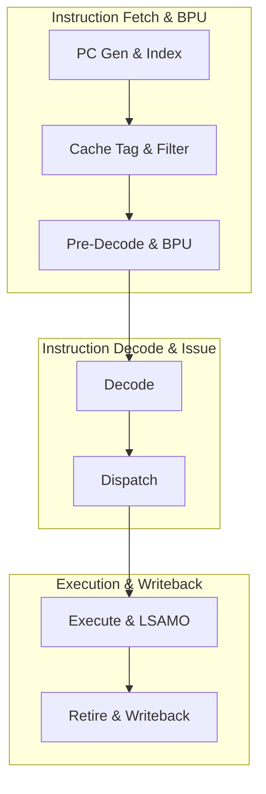

# Project Overview

This document outlines the design goals, context, and key system requirements of the Crab Core, serving as the high-level project specification.

---

## 1. Project Context & Origins

**Pulsar-V** is a family of general-purpose processors developed by the student research club **AGH Logic Unit**. The primary goal of the project is to design a **Linux-capable CPU** and eventually manufacture it on silicon (tape-out).

The project naming scheme is inspired by astrophysics:

*   **Pulsar-V** refers to **pulsars** (rotating neutron stars).
*   **Crab** is the first core model of the family, named after the **Crab Nebula** (which contains the Crab Pulsar at its center).

The **Crab Core** is designed specifically as an in-order core (hart) and features a **7-stage in-order pipeline** optimized for frequency and area efficiency.

---

## 2. Design Goals & Strategy

The development of the Crab Core is based on the following technical strategies:

| Strategy | Description | Key Implementation Focus |
| :--- | :--- | :--- |
| **Linux Support** | Booting a standard Linux kernel directly on the core. | Implementation of Machine (M), Supervisor (S), and User (U) privilege modes, Sv39 Virtual Memory, and 16 Physical Memory Protection (PMP) entries. |
| **FPGA & ASIC Targets** | Ensuring the RTL is highly synthesis-friendly. | RTL structured to map efficiently to FPGA Block RAMs/DSPs while utilizing standard clock-gating cells and memory macros for ASIC tape-outs. |
| **Pipeline Performance** | Maximizing operating frequency and throughput. | Leveraging a zero-cycle BTB, a gshare branch predictor, scoreboard-based hazard resolution at dispatch, and a split-array retirement buffer (ROB). |
| **Decoupled Design** | Simplifying future design iterations. | Separating the execution stages, memory subsystems (L1 caches), and writeback logic. |
| **Robust Verification** | Guaranteeing functional correctness. | Relying on Cocotb (Python), pytest, and Verilator to run comprehensive regressions and RISC-V compliance tests. |

---

## 3. Core Requirements & Specifications

### Instruction Set Architecture (ISA)
*   **Base & Extensions:** `RV64GC`
    *   **RV64I:** Base 64-bit Integer ISA.
    *   **M Extension:** Integer Multiplication and Division.
    *   **A Extension:** Atomic Memory Operations (including Load-Reserved/Store-Conditional and AMO ALU operations).
    *   **F & D Extensions:** Single- and Double-Precision Floating-Point support.
    *   **C Extension:** Compressed Instructions (16-bit) to reduce code footprint.
    *   **Privileged Spec:** Fully supports `Zicsr` (Control and Status Registers) and `Zifencei` (Instruction Fetch fence).

### Privileged Architecture & Security
*   **Privilege Modes:** Three modes of operation are supported:
    *   **Machine Mode (M-Mode)**
    *   **Supervisor Mode (S-Mode)**
    *   **User Mode (U-Mode)**
*   **Physical Memory Protection (PMP):** 16 configurable entries checking Read (R), Write (W), and Execute (X) permissions on physical addresses with immediate pipeline flush on permission configuration changes.

### Memory & Virtualization
*   **Virtual Memory:** Sv39 Virtual Memory support enabling translation of 39-bit virtual addresses into physical addresses. Includes fully associative Instruction TLB (I-TLB) and Data TLB (D-TLB) backed by a hardware Page Table Walker (PTW).
*   **Memory Subsystem:**
    *   **L1 Instruction Cache:** 64-bit fetch width to resolve compressed instruction alignment across boundaries.
    *   **L1 Data Cache:** High-speed cache supporting write-back/write-allocate policies, local reservations, and cache-side AMOs.
