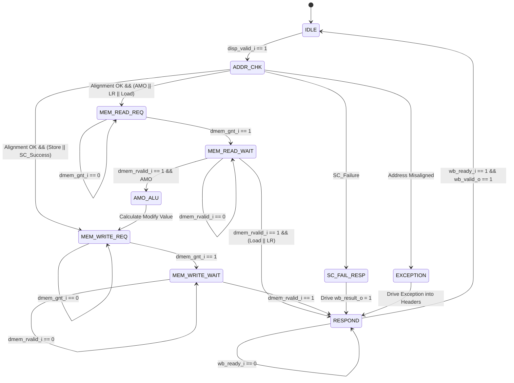

# Load-Store & Atomic Memory Operations Module

!!! abstract "Module Card"
    * :material-file-code: **RTL file:** `N/A`
    * :material-progress-wrench: **Status:** `Draft`

## 1. Changelog

| Date | Version | Description |
| :-- | :--: | :-- |
| 2026-08-05 | v0.4 | Added flush_i port and speculative load/store flush behavior, and renamed headers to exe_headers_t |
| 2026-05-24 | v0.3 | Added RV64FD floating-point load and store operations |
| 2026-05-23 | v0.2 | Complete rewrite specifying Load-Store and RV64A AMO FSM |
| 2026-04-26 | v0.1 | First draft (placeholder) |

## 2. Overview

The **LSO-AMO** module is a stateful execution unit in the execution (EX) stage of the Pulsar-V core. It is responsible for executing all load, store, and atomic memory operations.

Standard loads and stores are completed by interfacing directly with the Data Cache (D-Cache) or memory bus. For Atomic Memory Operations (AMOs), which require a read-modify-write sequence, the module uses a Finite State Machine (FSM) to coordinate access and guarantee atomicity. It also contains the necessary logic to manage Load-Reserved / Store-Conditional (LR/SC) reservations.

## 3. Architectural Requirements

The module is required to implement the following RISC-V Unprivileged ISA specifications:

- **RV64I Load/Store Instructions:**
    - Loads: `LB`, `LBU` (byte), `LH`, `LHU` (halfword), `LW`, `LWU` (word), `LD` (doubleword).
    - Stores: `SB` (byte), `SH` (halfword), `SW` (word), `SD` (doubleword).
- **RV64A Atomic Instructions (XLEN=64):**
    - Load-Reserved: `LR.W`, `LR.D`.
    - Store-Conditional: `SC.W`, `SC.D`.
    - Atomic Memory Operations (AMO): `AMOSWAP`, `AMOADD`, `AMOAND`, `AMOOR`, `AMOXOR`, `AMOMIN`, `AMOMAX`, `AMOMINU`, `AMOMAXU` in word (`.W`) and doubleword (`.D`) variants.
- **RV64FD Floating-Point Load/Store Instructions:**
    - Floating Loads: `FLW` (single-precision), `FLD` (double-precision).
    - Floating Stores: `FSW` (single-precision), `FSD` (double-precision).
- **Alignment:**
    - The module requires natural alignment for all memory accesses. If an address is not aligned to the size of the access, a misaligned address exception is raised.

## 4. Interfaces

### 4.1 Pipeline Interface

| Signal | Type | Width | Direction | Description |
| :--- | :---: | :---: | :---: | :--- |
| `clk_i` | `logic` | 1 | IN | Clock signal |
| `rst_ni` | `logic` | 1 | IN | Asynchronous active-low reset signal |
| `flush_i` | `logic` | 1 | IN | Pipeline flush signal |
| `disp_valid_i` | `logic` | 1 | IN | Dispatcher handshake indicating valid memory/AMO request |
| `disp_ready_o` | `logic` | 1 | OUT | Handshake indicating unit is ready to accept a new instruction |
| `disp_headers_i`| `exe_headers_t`| - | IN | Input execution stage header metadata from Dispatcher |
| `operand_a_i` | `logic` | 64 | IN | Base address register (typically RS1) |
| `operand_b_i` | `logic` | 64 | IN | Store data (integer or float) or AMO operand (typically RS2 or FRS2) |
| `imm_i` | `logic` | 64 | IN | Immediate offset value (used for load/store address generation) |
| `operator_i` | `logic` | 6 | IN | Encoded operation type (representing LB, FLW, SW, FSW, AMOADD, etc.) |
| `disp_snoop_invalidate_valid_i` | `logic` | 1 | IN | Optional input indicating external coherence invalidation of a cache line (multi-hart only; tie to 0 for single-hart) |
| `disp_snoop_invalidate_addr_i`  | `logic` | 64 | IN | Cache line physical address being invalidated externally (multi-hart only) |
| `wb_valid_o` | `logic` | 1 | OUT | Writeback handshake indicating valid result/exception is ready |
| `wb_ready_i` | `logic` | 1 | IN | Handshake indicating Writeback Arbiter can accept result |
| `wb_result_o` | `logic` | 64 | OUT | Read data (loads/AMOs, integer or float) or SC result to write back to destination register (GPR or FPR) |
| `wb_headers_o` | `exe_headers_t`| - | OUT | Output execution stage header metadata to Writeback Buffer |

### 4.2 D-Cache / Memory Interface

| Signal | Type | Width | Direction | Description |
| :--- | :---: | :---: | :---: | :--- |
| `dmem_req_o` | `logic` | 1 | OUT | Memory request validation flag |
| `dmem_gnt_i` | `logic` | 1 | IN | Memory subsystem grant (address phase accepted) |
| `dmem_addr_o` | `logic` | 64 | OUT | Memory access physical address |
| `dmem_we_o` | `logic` | 1 | OUT | Write enable (1 = Write, 0 = Read) |
| `dmem_wdata_o` | `logic` | 64 | OUT | Memory write data payload |
| `dmem_be_o` | `logic` | 8 | OUT | Byte enable strobes for write masking |
| `dmem_size_o` | `logic` | 2 | OUT | Size of memory operation (00 = Byte, 01 = Halfword, 10 = Word, 11 = Doubleword) |
| `dmem_lock_o` | `logic` | 1 | OUT | Lock signal asserted during atomic RMW sequences to request exclusive line access |
| `dmem_rvalid_i` | `logic` | 1 | IN | Data validation flag (read data available or write acknowledged) |
| `dmem_rdata_i` | `logic` | 64 | IN | Memory read data input from memory |
| `dmem_err_i` | `logic` | 1 | IN | Memory access error response (e.g., bus fault) |

---

## 5. Functional Description

### 5.1 Address Generation and Alignment Check
* **Load/Store Address:** Address is calculated as `Addr = operand_a_i + imm_i`.
* **AMO / LR / SC Address:** Address is taken directly from `operand_a_i` (no immediate offset is applied).
* **Alignment Validation:** The lower bits of the calculated address must be zero based on the size:
    - Doubleword (`64b`): `addr[2:0] == 3'b000`
    - Word (`32b`): `addr[1:0] == 2'b00`
    - Halfword (`16b`): `addr[0] == 1'b0`
    - Byte (`8b`): Always aligned.
  If alignment fails, `wb_headers_o.exc_valid` is set to `1` and `wb_headers_o.exc_code` is loaded with the appropriate cause code (e.g. Load Address Misaligned or Store/AMO Address Misaligned), bypassing the memory request phase.

### 5.2 Load-Reserved / Store-Conditional Logic
* **LR Register:** The module maintains a local `reservation_addr` register and a `reservation_valid` flag.
* **Cache-Line Granularity:** To support future multi-hart cache coherence, `reservation_addr` stores the address at **cache-line granularity** (e.g., comparing only the upper bits `addr[63:6]` for a 64-byte cache line).
* **LR Execution:** Executes as a standard load, but stores the cache-line address in `reservation_addr` and sets `reservation_valid = 1`.
* **SC Execution:** Checks the reservation logic:
    - If `reservation_valid` is set and the access address's cache line matches `reservation_addr`, the write is issued to memory. Upon memory completion, `wb_result_o` is set to `0` (success) and `reservation_valid` is cleared.
    - If `reservation_valid` is cleared or the cache-line address does not match, the write request to memory is bypassed. `wb_result_o` is immediately set to `1` (failure) and returned.
* **Reservation Invalidation:** The reservation is automatically cleared (`reservation_valid = 0`) on:
    - Any standard store instruction executed by the local hart.
    - An exception or interrupt occurrence (to prevent context switch leakage).
    - External snoop invalidation triggers: when `disp_snoop_invalidate_valid_i` is high and `disp_snoop_invalidate_addr_i[63:6] == reservation_addr`.

---

### 5.3 AMO Finite State Machine (FSM)

Atomic Memory Operations require a read-modify-write cycle. The FSM manages this sequence atomically by asserting `dmem_lock_o` to lock the target cache line (or stall D-Cache requests from other sources/DMA) and prevent evictions while the operation is in progress.

`dmem_lock_o` is driven **high** when the FSM exits `IDLE` for an AMO instruction, and remains asserted through `MEM_READ_REQ`, `MEM_READ_WAIT`, `AMO_ALU`, `MEM_WRITE_REQ`, and `MEM_WRITE_WAIT`. It is deasserted only when transitioning to `RESPOND`.

#### FSM State Descriptions:
1. **`IDLE`**: Module is waiting for a valid command from the dispatcher (`disp_valid_i`).
2. **`ADDR_CHK`**: Computes the address and checks alignment rules.
3. **`MEM_READ_REQ`**: Asserts `dmem_req_o` to read the data from memory. Loop in this state until granted (`dmem_gnt_i`).
4. **`MEM_READ_WAIT`**: Waits for the memory system to return read data (`dmem_rvalid_i`).
5. **`AMO_ALU`**: The loaded data is stored in a temporary register and processed using a local arithmetic unit based on `operator_i` (e.g., adding `operand_b_i` to it).
6. **`MEM_WRITE_REQ`**: Asserts `dmem_req_o` with `dmem_we_o = 1` to write the modified value back to the same address.
7. **`MEM_WRITE_WAIT`**: Waits for write acknowledgment (`dmem_rvalid_i`).
8. **`SC_FAIL_RESP`**: Formulates the SC failure packet directly, bypassing memory access.
9. **`EXCEPTION`**: Configures exception headers (`wb_headers_o.exc_valid = 1`, `wb_headers_o.exc_code`).
10. **`RESPOND`**: Drives the destination register result (`wb_result_o`) and validates the pipeline output (`wb_valid_o`). If `wb_ready_i` is low (due to arbiter stalls), the FSM holds in this state, keeping the output registered data stable. Once accepted by the Writeback Arbiter (`wb_ready_i == 1`), transitions back to `IDLE`. Note that while stalled in this state, the register file bypass network can forward the result from `wb_result_o` directly.

---

### 5.4 AMO Operations & ALU Function

During the **`AMO_ALU`** state, a dedicated ALU inside the LSO-AMO module performs one of the following operations:

| AMO Operation | Description | ALU Formula |
| :--- | :--- | :--- |
| `AMOSWAP.W/D` | Swap operands | $Result = Operand\ B$ |
| `AMOADD.W/D` | Addition | $Result = Loaded\ +\ Operand\ B$ |
| `AMOAND.W/D` | Bitwise AND | $Result = Loaded\ \&\ Operand\ B$ |
| `AMOOR.W/D` | Bitwise OR | $Result = Loaded\ \|\ Operand\ B$ |
| `AMOXOR.W/D` | Bitwise XOR | $Result = Loaded\ \oplus\ Operand\ B$ |
| `AMOMIN.W/D` | Signed Minimum | $Result = (Loaded <_s Operand\ B) ? Loaded : Operand\ B$ |
| `AMOMAX.W/D` | Signed Maximum | $Result = (Loaded >_s Operand\ B) ? Loaded : Operand\ B$ |
| `AMOMINU.W/D`| Unsigned Minimum| $Result = (Loaded <_u Operand\ B) ? Loaded : Operand\ B$ |
| `AMOMAXU.W/D`| Unsigned Maximum| $Result = (Loaded >_u Operand\ B) ? Loaded : Operand\ B$ |

*Note:* For `.W` instructions, operations are done on the lower 32 bits, and the final result is sign-extended to 64 bits before being written back to memory and register file.

### 5.5 Floating-Point Loads and Stores
Floating-point loads and stores are processed by the memory FSM similarly to integer loads/stores:

* **`FLD` / `FSD`:** Transferred as 64-bit doublewords (`dmem_size_o = 2'b11`). Data passes directly between memory and FPRs.
* **`FLW`:** Transferred as a 32-bit word (`dmem_size_o = 2'b10`). Read data returned from memory is **NaN-boxed** to 64 bits (upper 32 bits set to `0xFFFFFFFF`) before being driven on `wb_result_o` to satisfy the RV64F specification.
* **`FSW`:** Transferred as a 32-bit word (`dmem_size_o = 2'b10`). The store data is extracted from the lower 32 bits of `operand_b_i` (the source FPR value).

### 5.6 Speculative Flush (Memory Request Invalidation)
Memory operations require careful speculative handling to avoid corrupting core or memory state:

* **Speculative Loads:** If a load instruction is in-flight (e.g. waiting in `MEM_READ_WAIT` for `dmem_rvalid_i`) and a pipeline flush occurs (`flush_i == 1`):
    - The LSO-AMO FSM immediately aborts the operation and returns to the `IDLE` state.
    - Any data returned by the memory subsystem (`dmem_rdata_i`) in subsequent cycles is discarded and **never** written back to the GPR/FPR file or the ROB.
* **Speculative Stores:** Stores in the Execute stage only perform address generation and alignment validation. They **never** issue a memory write request (`dmem_req_o` is kept low) during Stage 8. Writes are only issued to the Store Buffer (STB) / D-Cache at retirement (Stage 9) when they are guaranteed to commit.
* **Atomic Memory Operations (AMOs):** AMOs operate under an **Execute-at-Retire** strategy. They are held in the ROB and only executed by the LSO-AMO FSM at retirement (Stage 9), preventing speculative memory lock and write operations.
* **Speculative Flush during active AMO:** Since AMOs only execute at retirement, they cannot be flushed once they start. If a flush is requested due to a concurrent asynchronous interrupt at retirement, the AMO executes to completion before the interrupt handler is entered.

---

## 6. Timing and Performance

- **Standard Loads/Stores:** 2-3 cycles (1 cycle for address generation/request, 1 cycle for wait/completion, depending on D-Cache hits).
- **AMO Operations:** 4-6 cycles depending on memory grant and read validation latencies, as they require a sequential read and write transaction.
- **SC Failures:** Completed in 1 cycle, as no memory access is required.

---

## 7. Verification

LSO-AMO module verification is based on constrained random verification:

1. **FSM Coverage:** Ensure 100% state and transition coverage of the AMO control FSM.
2. **LR/SC Reservation Integrity:** Verifying that:
    - Reservations are set correctly on LR.
    - SC succeeds only on matching addresses with active reservation.
    - Reservations are cleared correctly by any intervening store, exception, or reset.
3. **Misaligned Address Triggers:** Injecting misaligned addresses for all sizes (16-bit, 32-bit, 64-bit) to verify exception generation.
4. **Memory Subsystem Backpressure:** Simulating late grants (`dmem_gnt_i`) and late read validations (`dmem_rvalid_i`) to ensure FSM remains stable.

---

## 8. Future Scalability Considerations (Multi-Hart & Superscalar)

To ensure this module can transition to a superscalar or multi-hart architecture with minimal redesign, the following hooks are implemented:

* **Snoop Invalidation Port:** The signals `disp_snoop_invalidate_valid_i` and `disp_snoop_invalidate_addr_i` allow a cache-coherence manager to invalidate the internal reservation remotely. For single-hart execution, these are tied to 0.
* **Cache-Line Reservation:** Address comparison is evaluated at the cache-line level (`addr[63:6]`), aligning it with multi-core coherence granularity where invalidations happen per cache line.
* **Memory Locking:** The `dmem_lock_o` output is asserted during the RMW FSM sequence. In a multi-core design, this signals the L1 cache controller to request and lock Exclusive/Modified ownership of the line to prevent remote accesses until completed.
* **Isolated Memory Lane:** The LSO-AMO acts as a standalone execution unit and can be instantiated as a dedicated memory execution lane in a multi-issue superscalar pipeline.
