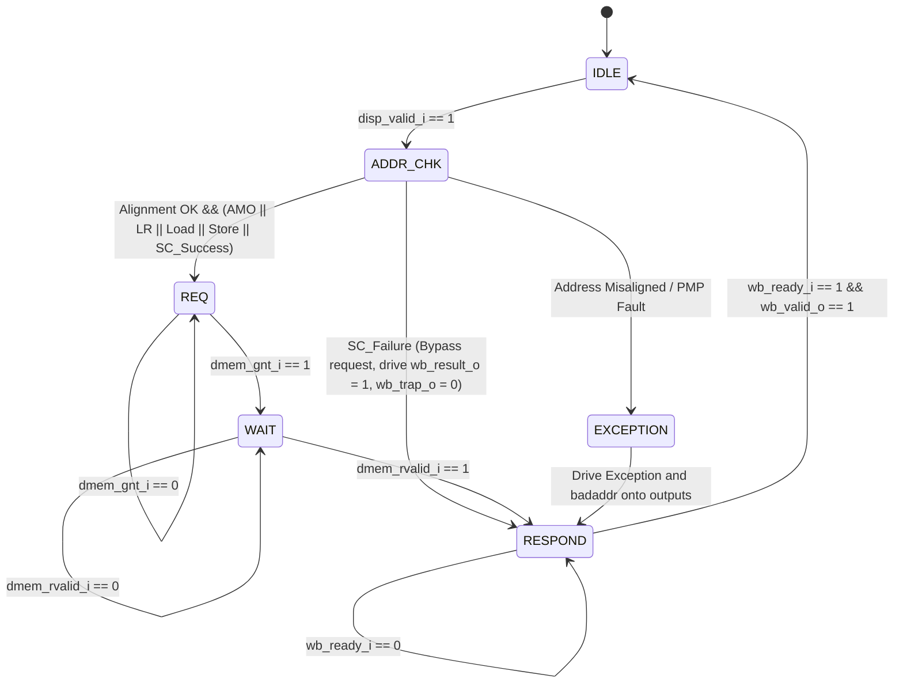

# Load-Store & Atomic Memory Operations Module

!!! abstract "Module Card"
    * :material-file-code: **RTL file:** `N/A`
    * :material-progress-wrench: **Status:** `Draft`

## 1. Changelog

| Date | Version | Description |
| :-- | :--: | :-- |
| 2026-08-07 | v0.5 | Simplified FSM to 6 states, offloaded AMO operations to L1 D-Cache (Cache-Side RMW), replaced dmem_lock_o with dmem_amo_req_o and dmem_amo_op_o. |
| 2026-08-06 | v0.4 | Added flush_i port and speculative load/store flush behavior, and renamed headers to exe_headers_t |
| 2026-05-24 | v0.3 | Added RV64FD floating-point load and store operations |
| 2026-05-23 | v0.2 | Complete rewrite specifying Load-Store and RV64A AMO FSM |
| 2026-04-26 | v0.1 | First draft (placeholder) |

## 2. Overview

The **LSO-AMO** module is a stateful execution unit in the execution (EX) stage (Stage 6) of the Pulsar-V Crab Core. It is responsible for executing all load, store, and atomic memory operations.

The LSO-AMO module is integrated alongside the **Store Buffer (STB)** inside a top-level **LSU (Load-Store Unit)**. To simplify the execution stage and save silicon area, the Crab Core employs a **Cache-Side RMW (Read-Modify-Write)** strategy for Atomic Memory Operations (AMOs). The arithmetic logic for AMOs is offloaded directly to the L1 Data Cache. Consequently, the LSO-AMO module functions as a unified request generator, treating AMOs exactly like standard loads with additional metadata flags. It also manages the local Load-Reserved / Store-Conditional (LR/SC) reservation state.

---

## 3. Architectural Requirements

The module is required to implement the following RISC-V Unprivileged ISA specifications:

- **RV64I Load/Store Instructions:**
    - Loads: `LB`, `LBU` (byte), `LH`, `LHU` (halfword), `LW`, `LWU` (word), `LD` (doubleword).
    - Stores: `SB` (byte), `SH` (halfword), `SW` (word), `SD` (doubleword).
- **RV64A Atomic Instructions (XLEN=64):**
    - Load-Reserved: `LR.W`, `LR.D`.
    - Store-Conditional: `SC.W`, `SC.D`.
    - Atomic Memory Operations (AMO): `AMOSWAP`, `AMOADD`, `AMOAND`, `AMOOR`, `AMOXOR`, `AMOMIN`, `AMOMAX`, `AMOMINU`, `AMOMAXU` in word (`.W`) and doubleword (`.D`) variants.
- **RV64FD Floating-Point Load/Store Instructions:**
    - Floating Loads: `FLW` (single-precision), `FLD` (double-precision).
    - Floating Stores: `FSW` (single-precision), `FSD` (double-precision).
- **Alignment:**
    - The module requires natural alignment for all memory accesses. If an address is not aligned to the size of the access, a misaligned address exception is raised.

---

## 4. Parameters

The LSU and its Store Buffer (STB) are parameterized to allow optimization for different FPGA/ASIC targets:

| Parameter Name | Type | Default Value | Description |
| :--- | :---: | :---: | :--- |
| `STB_DEPTH` | `int` | `4` | Depth of the Store Buffer (number of speculative store entries). Must be a power of 2. |

---

## 5. Interfaces

### 5.1 Pipeline Interface (Stage 6 Execute Boundary)

| Signal | Type | Width | Direction | Description |
| :--- | :---: | :---: | :---: | :--- |
| `clk_i` | `logic` | 1 | IN | Clock signal |
| `rst_ni` | `logic` | 1 | IN | Asynchronous active-low reset signal |
| `flush_i` | `logic` | 1 | IN | Pipeline flush signal |
| `disp_valid_i` | `logic` | 1 | IN | Dispatcher handshake indicating valid memory/AMO request |
| `disp_ready_o` | `logic` | 1 | OUT | Handshake indicating unit is ready to accept a new instruction |
| `disp_headers_i`| `exe_headers_t`| - | IN | Input execution stage header metadata from Dispatcher |
| `operand_a_i` | `logic` | 64 | IN | Base address register (typically RS1) |
| `operand_b_i` | `logic` | 64 | IN | Store data (integer or float) or AMO operand (typically RS2 or FRS2) |
| `imm_i` | `logic` | 64 | IN | Immediate offset value (used for load/store address generation) |
| `operator_i` | `logic` | 6 | IN | Encoded operation type (representing LB, FLW, SW, FSW, AMOADD, etc.) |
| `stb_empty_i` | `logic` | 1 | IN | Input from Store Buffer indicating all committed stores have been drained to cache |
| `wb_valid_o` | `logic` | 1 | OUT | Writeback handshake indicating valid result/exception is ready |
| `wb_ready_i` | `logic` | 1 | IN | Handshake indicating Writeback Arbiter can accept result |
| `wb_result_o` | `logic` | 64 | OUT | Operation result (read data for loads/AMOs, SC status) OR faulting virtual address (badaddr) if `wb_trap_o` is active |
| `wb_trap_o` | `logic` | 1 | OUT | Exception indicator (asserted on address misaligned, PMP fault, or page fault) |
| `wb_cause_o` | `logic` | 6 | OUT | Exception cause code (valid when `wb_trap_o` is 1) |
| `wb_headers_o` | `exe_headers_t`| - | OUT | Carry-over tracking header (contains only the `tag` for ROB addressing) |

### 5.2 L1 Data Cache Interface (Top-level LSU Boundary)

| Signal | Type | Width | Direction | Description |
| :--- | :---: | :---: | :---: | :--- |
| `dmem_req_o` | `logic` | 1 | OUT | Memory request validation flag |
| `dmem_gnt_i` | `logic` | 1 | IN | Memory subsystem grant (address phase accepted) |
| `dmem_addr_o` | `logic` | 64 | OUT | Memory access physical address |
| `dmem_we_o` | `logic` | 1 | OUT | Write enable (1 = Write, 0 = Read) |
| `dmem_wdata_o` | `logic` | 64 | OUT | Memory write data payload (for stores and AMO operands) |
| `dmem_be_o` | `logic` | 8 | OUT | Byte enable strobes for write masking |
| `dmem_size_o` | `logic` | 2 | OUT | Size of memory operation (00 = Byte, 01 = Halfword, 10 = Word, 11 = Doubleword) |
| `dmem_amo_req_o` | `logic` | 1 | OUT | Active high flag indicating transaction is an Atomic Memory Operation |
| `dmem_amo_op_o` | `logic` | 5 | OUT | Encoded AMO operation (RISC-V `funct5` field) |
| `dmem_snoop_invalidate_valid_i` | `logic` | 1 | IN | Input indicating external coherence invalidation of a cache line (multi-hart only) |
| `dmem_snoop_invalidate_addr_i`  | `logic` | 64 | IN | Cache line physical address being invalidated externally (multi-hart only) |
| `dmem_rvalid_i` | `logic` | 1 | IN | Data validation flag (read data available or write acknowledged) |
| `dmem_rdata_i` | `logic` | 64 | IN | Memory read data input (contains original pre-AMO value for atomic operations) |
| `dmem_err_i` | `logic` | 1 | IN | Memory access error response (e.g., bus fault or PMP violation) |

---

## 6. Functional Description

### 6.1 Address Generation and Alignment Check
* **Load/Store Address:** Address is calculated as `Addr = operand_a_i + imm_i`.
* **AMO / LR / SC Address:** Address is taken directly from `operand_a_i` (no immediate offset is applied).
* **Alignment Validation:** The lower bits of the calculated address must be zero based on the size:
    - Doubleword (`64b`): `addr[2:0] == 3'b000`
    - Word (`32b`): `addr[1:0] == 2'b00`
    - Halfword (`16b`): `addr[0] == 1'b0`
    - Byte (`8b`): Always aligned.
  If alignment fails, `wb_trap_o` is set to `1`, `wb_cause_o` is loaded with the appropriate cause code (Load Address Misaligned or Store/AMO Address Misaligned), and `wb_result_o` is loaded with the faulting address (badaddr), bypassing the memory request phase.

### 6.2 Load-Reserved / Store-Conditional Logic
* **LR Register:** The module maintains a local `reservation_addr` register and a `reservation_valid` flag.
* **Cache-Line Granularity:** To support future multi-hart cache coherence, `reservation_addr` stores the address at **cache-line granularity** (comparing only the upper address bits `[63:6]` for a 64-byte cache line).
* **LR Execution:** Executes as a standard load, but stores the cache-line address in `reservation_addr` and sets `reservation_valid = 1`.
* **SC Execution:** Checks the reservation logic:
    - If `reservation_valid` is set and the access address's cache line matches `reservation_addr`, the write is issued to the Store Buffer as a speculative SC-store. Upon memory completion (at retirement), `wb_result_o` is set to `0` (success) and `reservation_valid` is cleared.
    - If `reservation_valid` is cleared or the cache-line address does not match, the memory access is bypassed. `wb_result_o` is immediately set to `1` (failure) and returned.
* **Reservation Invalidation:** The reservation is automatically cleared (`reservation_valid = 0`) on:
    - Any standard store instruction executed by the local hart.
    - An exception or interrupt occurrence (to prevent context switch leakage).
    - Writes to the `satp` address translation CSR (context switches) or execution of `SFENCE.VMA` (TLB invalidations) at Stage 7.
    - External snoop invalidation triggers: when `dmem_snoop_invalidate_valid_i` is high and `dmem_snoop_invalidate_addr_i[63:6] == reservation_addr`.

---

### 6.3 LSO Finite State Machine (FSM)

The FSM is highly simplified as it no longer coordinates a split read-modify-write cycle inside the core. It treats AMOs as a single-cycle request phase, delegating atomicity and logic calculation to the L1 Cache.



#### FSM State Descriptions:
1. **`IDLE`**: Module is waiting for a valid command from the dispatcher (`disp_valid_i`).
2. **`ADDR_CHK`**: Computes the address, checks alignment rules, and checks if SC reservation is valid.
3. **`REQ`**: Asserts `dmem_req_o`. If the instruction is an AMO, sets `dmem_amo_req_o = 1` and `dmem_amo_op_o = funct5` (RISC-V encoding). Loops in this state until granted (`dmem_gnt_i == 1`).
4. **`WAIT`**: Waits for the memory system (L1 Cache) to return read data or write acknowledgment (`dmem_rvalid_i == 1`). If `dmem_err_i` is asserted, transitions to `EXCEPTION` to report the bus error.
5. **`EXCEPTION`**: Asserts `wb_trap_o = 1`, sets `wb_cause_o` to the detected exception code, and drives the faulting virtual address onto `wb_result_o` (badaddr).
6. **`RESPOND`**: Drives the destination register result (`wb_result_o`) and validates the pipeline output (`wb_valid_o`). If `wb_ready_i` is low (due to arbiter stalls), the FSM holds in this state, keeping output data stable.

---

### 6.4 Cache-Side Atomic Operations

During an AMO transaction (`dmem_amo_req_o = 1`), the L1 Data Cache Controller intercepts the transaction, lock-claims the cache line internally, and uses its own dedicated arithmetic unit to perform the following operations:

| RISC-V Instruction | funct5 | Cache-Side ALU Operation |
| :--- | :---: | :--- |
| `AMOSWAP.W/D` | `00000` | $Result = Operand\ B$ |
| `AMOADD.W/D` | `00001` | $Result = Loaded\ +\ Operand\ B$ |
| `AMOAND.W/D` | `01100` | $Result = Loaded\ \&\ Operand\ B$ |
| `AMOOR.W/D` | `01000` | $Result = Loaded\ \|\ Operand\ B$ |
| `AMOXOR.W/D` | `00100` | $Result = Loaded\ \oplus\ Operand\ B$ |
| `AMOMIN.W/D` | `10000` | $Result = (Loaded <_s Operand\ B) ? Loaded : Operand\ B$ |
| `AMOMAX.W/D` | `10100` | $Result = (Loaded >_s Operand\ B) ? Loaded : Operand\ B$ |
| `AMOMINU.W/D`| `11000` | $Result = (Loaded <_u Operand\ B) ? Loaded : Operand\ B$ |
| `AMOMAXU.W/D`| `11100` | $Result = (Loaded >_u Operand\ B) ? Loaded : Operand\ B$ |

*Note:* The Cache controller returns the **original loaded value** back to the core on `dmem_rdata_i`, and writes the calculated $Result$ back to its internal Cache Line data RAM.

---

### 6.5 Floating-Point Loads and Stores
Floating-point loads and stores are processed by the memory FSM similarly to integer loads/stores:

* **`FLD` / `FSD`:** Transferred as 64-bit doublewords (`dmem_size_o = 2'b11`). Data passes directly between memory and FPRs.
* **`FLW`:** Transferred as a 32-bit word (`dmem_size_o = 2'b10`). Read data returned from memory is **NaN-boxed** to 64 bits (upper 32 bits set to `0xFFFFFFFF`) before being driven on `wb_result_o` to satisfy the RV64F specification.
* **`FSW`:** Transferred as a 32-bit word (`dmem_size_o = 2'b10`). The store data is extracted from the lower 32 bits of `operand_b_i` (the source FPR value).

---

### 6.6 Speculative Flush & Store Buffer (STB) Lifecycle

To maintain precise exception integrity and support speculative execution without corrupting memory:

* **Speculative Loads:** If a load instruction is in-flight (waiting in `WAIT` for `dmem_rvalid_i`) and a pipeline flush occurs (`flush_i == 1`):
    - The LSO FSM immediately aborts the operation and returns to `IDLE`.
    - Any data returned by the memory subsystem (`dmem_rdata_i`) in subsequent cycles is discarded.
* **Speculative Stores:**
    - In Stage 6 (Execute), a Store instruction writes its calculated address, data, and size to the **Store Buffer (STB)**. The instruction is then marked as completed in the ROB and frees the execute stage.
    - The STB holds this entry in a **speculative state** within a FIFO buffer of depth `STB_DEPTH`. If a pipeline flush occurs (`flush_i == 1`), the STB automatically discards all speculative entries.
* **Store Buffer Stall (STB Full):**
    - If the number of speculative entries in the STB reaches `STB_DEPTH`, the STB asserts an internal `stb_full` signal.
    - While `stb_full` is active, the LSU deasserts `disp_ready_o` whenever the dispatcher attempts to issue a new Store instruction, stalling the pipeline at Dispatch (Stage 5) until older stores commit and free STB entries.
* **Store Commit (Retirement):**
    - When a Store instruction reaches the head of the ROB (Stage 7 - Retire) and commits, the ROB asserts a commit signal to the STB.
    - The STB marks the oldest speculative entry as **committed (non-speculative)** and drains it to the L1 Data Cache in the background when the D-Cache bus is free.
* **Atomic Memory Operations (AMOs):**
    - AMOs operate under an **Execute-at-Retire** strategy. They are held in the ROB and only executed when they reach retirement (Stage 7).
    - When an AMO reaches retirement, the writeback stage stalls until the Store Buffer is completely empty (`stb_empty_i == 1`) to ensure correct memory ordering.
    - Once the STB is empty, LSO-AMO executes the transaction to the L1 Cache.

---

### 6.7 LSU Hierarchy & Cache Port Arbitration

The top-level **LSU (Load-Store Unit)** encompasses both the **LSO-AMO FSM** and the **Store Buffer (STB)**:

```
                  +-----------------------------------+
                  |      LSU (Load-Store Unit)        |
                  |                                   |
                  |  +-------------+  +------------+  |
  Pipeline ──────>|  |   LSO-AMO   |  |   Store    |  |
  Inputs          |  |     FSM     |  |Buffer (STB)|  |
                  |  +------+------+  +-----+------+  |
                  |         |               |         |
                  |         v               v         |
                  |      +---------------------+      |
                  |      | LSU Port Arbiter    |      |
                  |      +----------+----------+      |
                  +-----------------|-----------------+
                                    |
                                    v (dmem_* ports)
                            [ L1 Data Cache ]
```

* **LSU Port Arbiter:** A hardware arbiter inside the LSU multiplexes access to the L1 Data Cache's `dmem_*` ports:
  * **Priority 1 (High):** Speculative loads and retirement-stage AMOs generated by the `LSO-AMO FSM`.
  * **Priority 2 (Low):** Draining of committed, non-speculative stores from the `Store Buffer (STB)`. This writeback occurs only when the LSO-AMO FSM is idle and not requesting memory accesses.

---

## 7. Timing and Performance

- **Standard Loads/Stores (Cache Hit):** 2 cycles (1 cycle for address generation/request, 1 cycle for wait/completion in Stage 6).
- **AMO Operations (Cache Hit):** 2 cycles of active bus transaction. However, the retirement stage stalls for the duration of the STB drain (variable, depending on `STB_DEPTH` and number of in-flight stores) + the 2-cycle cache RMW transaction.
- **SC Failures:** Completed in 1 cycle, as no memory access is required.

---

## 8. Verification

LSO-AMO module verification is based on constrained random verification:

1. **FSM Coverage:** Ensure 100% state and transition coverage of the simplified 6-state FSM.
2. **LR/SC Reservation Integrity:** Verifying reservation setting on LR, conditional execution on SC, and automatic invalidation on stores, traps, `satp` writes, `SFENCE.VMA`, and external snoop signals.
3. **PMA & PMP Exceptions:** Ensuring that misaligned address bounds and PMP violation signals correctly trigger exceptions.
4. **Memory Subsystem Backpressure:** Simulating late grants (`dmem_gnt_i`) and late read validations (`dmem_rvalid_i`) from the Wishbone/Cache system to ensure FSM remains stable.
5. **STB Parameterization Check:** Testing the module across multiple `STB_DEPTH` parameter values (e.g. 2, 4, 8) to verify that `stb_full` and `disp_ready_o` handshakes function properly under varying FIFO bounds.

---

## 9. Future Scalability Considerations (Multi-Hart & Superscalar)

To ensure this module can transition to a superscalar or multi-hart architecture with minimal redesign, the following hooks are implemented:

* **Snoop Invalidation Port:** The signals `dmem_snoop_invalidate_valid_i` and `dmem_snoop_invalidate_addr_i` allow a cache-coherence manager to invalidate the internal reservation remotely.
* **Cache-Line Reservation:** Address comparison is evaluated at the cache-line level (`addr[63:6]`), aligning it with multi-core coherence granularity where invalidations happen per cache line.
* **Cache-Side Atomic Execution:** Since the core offloads AMOs to the L1 Cache via `dmem_amo_req_o` and `dmem_amo_op_o`, the Cache handles exclusive line state (e.g., requesting exclusive ownership of the line to prevent remote accesses until completed) without needing a dedicated core-level lock signal.
