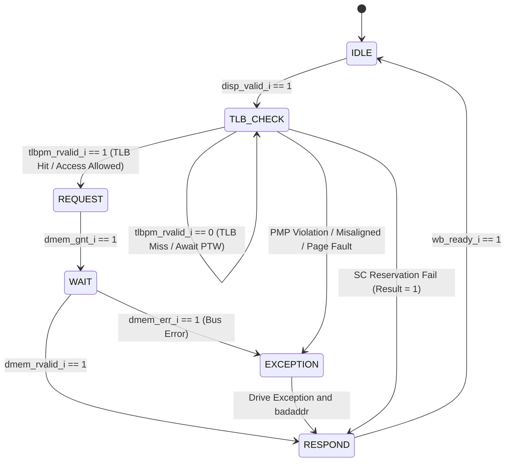

# Load-Store Unit Finite State Machine (LSU FSM)

!!! abstract "Module Card"
    * :material-file-code: **RTL file:** `N/A`
    * :material-progress-wrench: **Status:** `Draft`

## 1. Overview

The **LSU FSM** is the internal control state machine of the Load-Store Unit. It manages the execution lifecycle of memory requests received from Stage 5 (Dispatch), coordinates alignment and PMP/PMA security checks with the D-TLB, formats request signals to the LSU Port Arbiter, and drives writeback/trap results to Stage 7 (Writeback).

## 2. State Machine Architecture

## 3. Detailed State Operations & Transition Logic

### 3.1 State `IDLE`
* **Operation:** Idle state. Deasserts memory request signals and holds `disp_ready_o = 1` if no internal pipeline stall or pending serialized access is active.
* **Transition to `TLB_CHECK`:** Triggered when a valid standard memory uOp is issued by Dispatch (`disp_valid_i == 1 && disp_ready_o == 1`). Latches instruction metadata (`op`, `addr`, `wdata`, `size`, `tag`).
* **Ordering Constraint (AMO / MMIO):** When an Atomic Memory Operation (AMO) or uncacheable MMIO access is dispatched, the LSU accepts and latches the instruction into its internal holding register (`lsu_holding_valid <= 1'b1`) during the initial handshake cycle (`disp_valid_i && disp_ready_o`). Once latched, **`disp_ready_o` is deasserted (`0`)** to prevent Dispatch from issuing subsequent memory requests until the held AMO reaches the head of the ROB in Stage 7 (Commit) (`is_rob_head_i == 1`) and the Store Buffer is completely empty (`stb_empty_i == 1`). Once both conditions are fulfilled, the FSM transitions to `TLB_CHECK` to execute the atomic transaction.

### 3.2 State `TLB_CHECK` (Address & Security Evaluation)
* **Operation:** Address translation, security checks, and exception filtering are strictly evaluated in priority order:
    1. **D-TLB Request & Handshake:**
        * Virtual Address is submitted to the D-TLB (`tlbpm_addr_o = VA`).
        * **TLB Hit (`tlbpm_rvalid_i == 1`):** D-TLB returns `tlbpm_addr_i` (`PA[55:0]`), `tlbpm_pma_amo_level_i`, permission error flags (`tlbpm_err_r_i`, `tlbpm_err_w_i`), and exact cause codes (`tlbpm_cause_r_i`, `tlbpm_cause_w_i`) in a single cycle.
        * **TLB Miss (`tlbpm_rvalid_i == 0`):** The FSM holds in `TLB_CHECK`, stalling Stage 6 until the central Hardware PTW completes the page table walk and refills the D-TLB.
    2. **Alignment Check (Parallel):** Evaluated on lower virtual address bits `VA[2:0]` against access size ($VA[2:0] \equiv PA[2:0]$ in Sv39). On misalignment $\rightarrow$ transitions to `EXCEPTION` (`cause = 4` Load Misaligned, `cause = 6` Store/AMO Misaligned).
    3. **PMP & Translation Permission Check:** Evaluated from D-TLB response (`tlbpm_err_r_i`, `tlbpm_err_w_i`). If access is denied $\rightarrow$ transitions to `EXCEPTION`, capturing the exact cause code from `tlbpm_cause_r_i` (`cause = 5` Access Fault or `13` Page Fault) or `tlbpm_cause_w_i` (`cause = 7` Access Fault or `15` Page Fault). **This check has strict priority over SC reservation state.**
    4. **PMA AMO Capability Verification:** For AMO and LR/SC instructions, verifies if `tlbpm_pma_amo_level_i` satisfies the required level. If unsupported $\rightarrow$ transitions to `EXCEPTION` (`cause = 7` Store/AMO Access Fault).
    5. **SC Reservation Matching (Evaluated ONLY after Steps 2–4 PASS):** For `SC` instructions, verifies `reservation_valid` and matching address:
        * **Match & Valid:** Store is passed as speculative to STB, `wb_result_o = 0` (Success), and transitions to `REQUEST`.
        * **Mismatch or Invalid:** No entry is allocated in STB, `wb_result_o = 1` (Failure), and transitions directly to `RESPOND` without issuing a D-Cache write.

### 3.3 State `REQUEST` (Memory Grant Phase)
* **Operation:** Asserts `lsu_req_o = 1` to the LSU Port Arbiter. Drives physical address `dmem_addr_o = PA[55:0]`, `we`, `size`, and byte enables. For AMOs, asserts `dmem_amo_req_o = 1` and outputs `dmem_amo_op_o = funct5`.
* **Transition:** Holds in `REQUEST` while `dmem_gnt_i == 0`. Transitions to `WAIT` on the cycle when `dmem_gnt_i == 1`.

### 3.4 State `WAIT` (Memory Response Phase)
* **Operation:** Deasserts `lsu_req_o`. Awaits memory subsystem response from L1 Data Cache.
* **Transition:** Transitions to `RESPOND` when `dmem_rvalid_i == 1`. If `dmem_err_i == 1` is returned by the bus $\rightarrow$ transitions to `EXCEPTION` with bus error cause.

### 3.5 State `EXCEPTION` (Trap Formatting)
* **Operation:** Asserts `wb_trap_o = 1`, drives `wb_cause_o` with latched exception code, and routes faulting virtual address (`badaddr`) to `wb_result_o`. Transitions to `RESPOND`.

### 3.6 State `RESPOND` (Writeback Phase)
* **Operation:** Asserts `wb_valid_o = 1`. For standard loads and AMOs, drives `wb_result_o = dmem_rdata_i` (with sign-extension or NaN-boxing applied for 32-bit operations). For SC, drives `wb_result_o = sc_status` (0 = Success, 1 = Fail).
* **Transition:** Clears internal FSM registers and returns to `IDLE` when `wb_ready_i == 1`. If stalled by Writeback Arbiter (`wb_ready_i == 0`), holds `RESPOND` state and maintains stable outputs.

## 4. Pipeline Flush Behavior (`flush_i`)

When a global pipeline flush occurs (`flush_i == 1`):

* **In `IDLE`, `TLB_CHECK`, `REQUEST`:** The FSM immediately aborts and returns to `IDLE` in 1 cycle.
* **In `WAIT`:** The FSM returns to `IDLE`. Any late `dmem_rvalid_i` data returned by D-Cache in subsequent cycles is discarded.
* **In `RESPOND`:** If `wb_ready_i` was low, the flush clears `wb_valid_o` and resets to `IDLE`.

## 5. Verification

The LSU FSM control path is verified against the following formal properties:

### Formal SVA Assertion Table

| Assertion ID | Property / Condition | Severity | Checkpoint | Description |
| :--- | :--- | :---: | :---: | :--- |
| `SVA_FSM_01` | `(fsm_state == TLB_CHECK && !tlbpm_rvalid_i) |=> (fsm_state == TLB_CHECK)` | `ERROR` | **CHK-LSU-08** | FSM must hold in TLB_CHECK during TLB Miss until PTW Refill completes |
| `SVA_FSM_02` | `(fsm_state == REQUEST && !dmem_gnt_i) |=> (fsm_state == REQUEST)` | `ERROR` | **CHK-MMU-02** | FSM must hold in REQUEST until L1 D-Cache grants the address phase |
| `SVA_FSM_03` | `flush_i |=> (fsm_state == IDLE)` | `FATAL` | **CHK-PIPE-03** | FSM must abort any speculative state to IDLE in 1 cycle on pipeline flush |
| `SVA_FSM_04` | `(tlbpm_err_r_i && fsm_state == TLB_CHECK) |=> (wb_cause_o == tlbpm_cause_r_i)` | `ERROR` | **CHK-MMU-01** | LSU exception cause must strictly propagate the exact cause code from D-TLB |
| `SVA_FSM_05` | `(is_amo && lsu_holding_valid && !is_rob_head_i) |-> (disp_ready_o == 1'b0)` | `ERROR` | **CHK-LSU-04** | Dispatch ready must be deasserted while awaiting ROB commit head for held AMO |

### Testbench Coverage Goals
* **State Coverage:** 100% reachability of all FSM states (`IDLE`, `TLB_CHECK`, `REQUEST`, `WAIT`, `EXCEPTION`, `RESPOND`).
* **Transition Coverage:** 100% arc coverage, including early aborts on `flush_i` from every state.
* **Trap Code Integrity:** Verification of correct `mcause` encoding for misaligned accesses, PMP access faults, and page faults.
