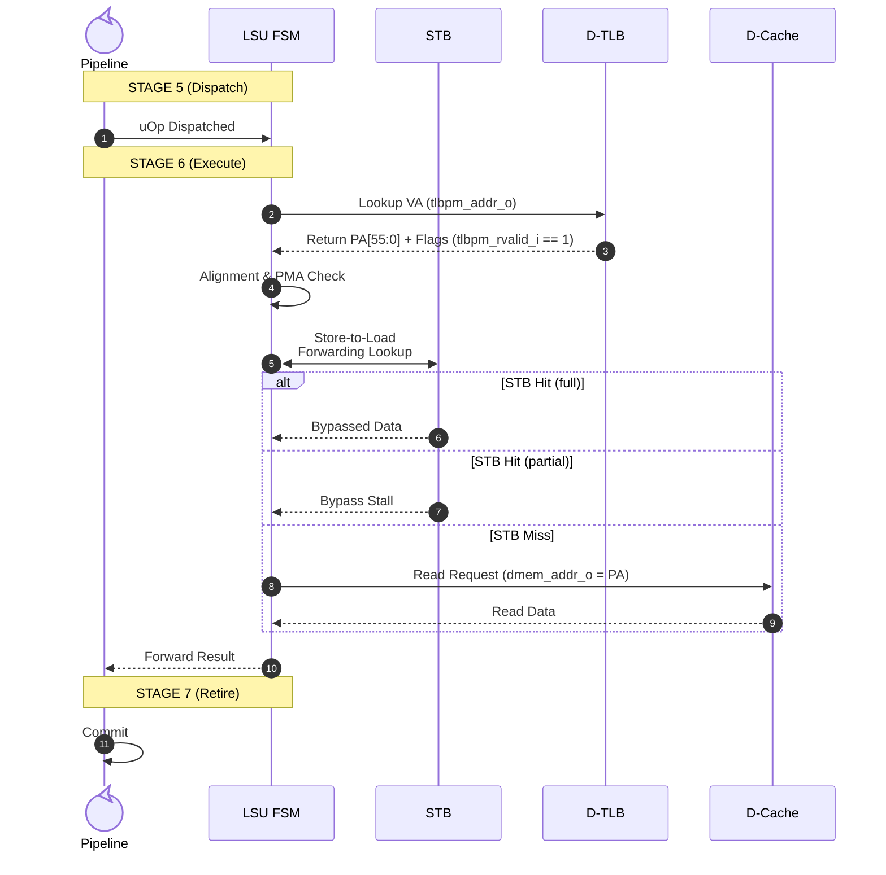
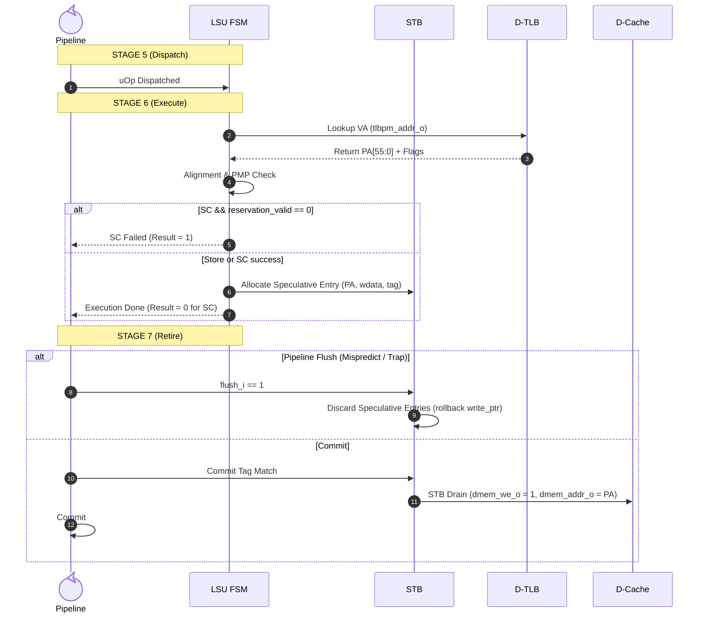
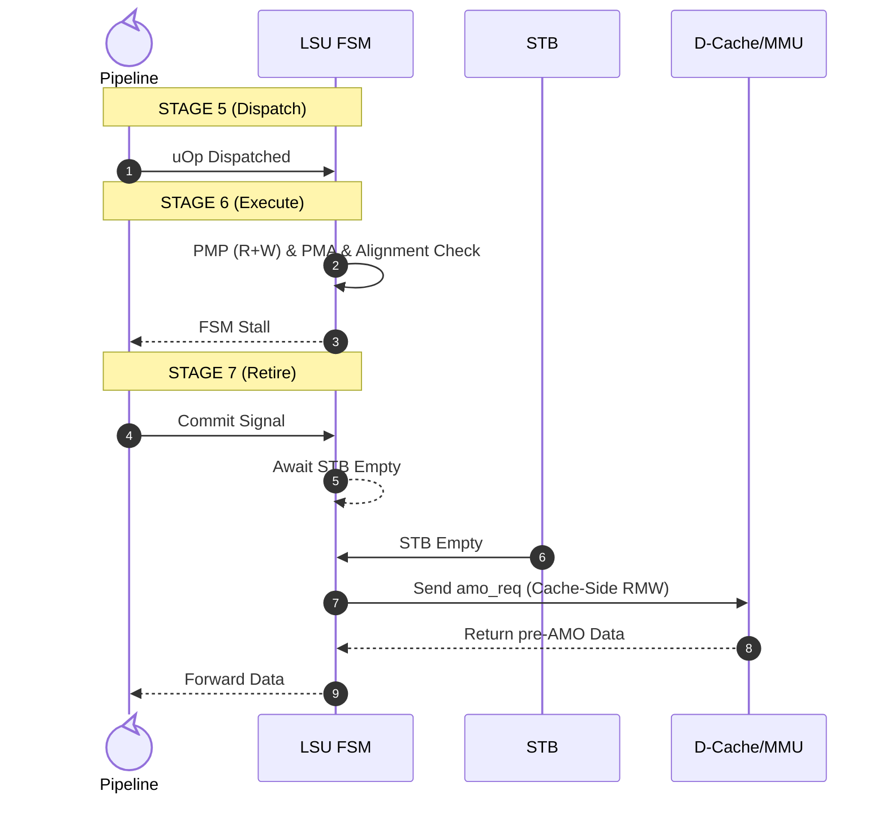

# Load Store Unit (LSU) Module

!!! abstract "Module Card"
    * :material-file-code: **RTL file:** `N/A`
    * :material-progress-wrench: **Status:** `Draft`

## 1. Changelog

| Date | Version | Description |
| :--- | :-----: | :--- |
| 2026-08-08 | v0.1 | Initial microarchitectural specification defining speculative store lifecycle, interfaces, and Store-to-Load Forwarding with partial-overlap stall. |

## 2. Overview

The **Load-Store Unit (LSU)** is the execution engine for all memory operations in Stage 6 (Execute) of the Crab Core. It coordinates address generation, physical security verification (PMP & PMA), Store Buffer queuing, and port arbitration to the L1 Data Cache / MMU subsystem.

## 3. Architectural Requirements

The module is required to implement the following RISC-V Unprivileged ISA specifications:

* **RV64I Load/Store Instructions:**
    * Loads: `LB`, `LBU` (byte), `LH`, `LHU` (halfword), `LW`, `LWU` (word), `LD` (doubleword).
    * Stores: `SB` (byte), `SH` (halfword), `SW` (word), `SD` (doubleword).
* **RV64A Atomic Instructions (XLEN=64):**
    * Load-Reserved: `LR.W`, `LR.D`.
    * Store-Conditional: `SC.W`, `SC.D`.
    * Atomic Memory Operations (AMO): `AMOSWAP`, `AMOADD`, `AMOAND`, `AMOOR`, `AMOXOR`, `AMOMIN`, `AMOMAX`, `AMOMINU`, `AMOMAXU` in word (`.W`) and doubleword (`.D`) variants.
* **RV64FD Floating-Point Load/Store Instructions:**
    * Floating Loads: `FLW` (single-precision), `FLD` (double-precision).
    * Floating Stores: `FSW` (single-precision), `FSD` (double-precision).
* **Alignment:**
    * The module requires natural alignment for all memory accesses. If an address is not aligned to the size of the access, a misaligned address exception is raised.

## 4. Parameters

| Parameter Name | Type | Default Value | Description |
| :--- | :---: | :---: | :--- |
| `STB_DEPTH` | `int` | `4` | Depth of the Store Buffer. Must be a power of 2. |

## 5. Interfaces

| Signal | Type | Width | Direction | Description |
| :--- | :---: | :---: | :---: | :--- |
| `clk_i` | `logic` | 1 | IN | Clock signal |
| `rst_ni` | `logic` | 1 | IN | Asynchronous active-low reset signal |
| `flush_i` | `logic` | 1 | IN | Pipeline flush signal |

### 5.1 Dispatch (Stage 5)

| Signal | Type | Width | Direction | Description |
| :--- | :---: | :---: | :---: | :--- |
| `disp_valid_i` | `logic` | 1 | IN | Dispatcher handshake indicating valid memory/AMO request |
| `disp_ready_o` | `logic` | 1 | OUT | Handshake indicating unit is ready to accept a new instruction |
| `disp_headers_i`| `exe_headers_t`| - | IN | Input execution stage header metadata from Dispatcher |
| `operand_a_i` | `logic` | 64 | IN | Base address register (typically `RS1`) |
| `operand_b_i` | `logic` | 64 | IN | Store data or AMO operand (typically `RS2` or `FRS2`) |
| `imm_i` | `logic` | 64 | IN | Immediate offset value for address generation |
| `operator_i` | `logic` | 6 | IN | Operation code |

### 5.2 Writeback (Stage 7)

| Signal | Type | Width | Direction | Description |
| :--- | :---: | :---: | :---: | :--- |
| `wb_valid_o` | `logic` | 1 | OUT | Writeback handshake indicating valid result/exception is ready |
| `wb_ready_i` | `logic` | 1 | IN | Handshake indicating Writeback Arbiter can accept result |
| `wb_result_o` | `logic` | 64 | OUT | Operation result (read data for loads/AMOs, SC status) OR faulting virtual address (`badaddr`) if `wb_trap_o` is active |
| `wb_trap_o` | `logic` | 1 | OUT | Exception indicator (asserted on address misaligned, PMP fault, or page fault) |
| `wb_cause_o` | `logic` | 6 | OUT | Exception cause code (valid when `wb_trap_o` is 1) |
| `wb_headers_o` | `exe_headers_t`| - | OUT | Output execution stage header metadata to Writeback Buffer |

### 5.3 D-Cache

| Signal | Type | Width | Direction | Description |
| :--- | :---: | :---: | :---: | :--- |
| `dmem_req_o` | `logic` | 1 | OUT | Memory request validation flag |
| `dmem_gnt_i` | `logic` | 1 | IN | Memory subsystem grant (address phase accepted) |
| `dmem_addr_o` | `logic` | 56 | OUT | Memory access physical address (`PA[55:0]`) |
| `dmem_we_o` | `logic` | 1 | OUT | Write enable (1 = Write, 0 = Read) |
| `dmem_wdata_o` | `logic` | 64 | OUT | Memory write data payload (for stores and AMO operands) |
| `dmem_be_o` | `logic` | 8 | OUT | Byte enable strobes for write masking |
| `dmem_size_o` | `logic` | 2 | OUT | Size of memory operation (`00` = Byte, `01` = Halfword, `10` = Word, `11` = Doubleword) |
| `dmem_amo_req_o` | `logic` | 1 | OUT | Active high flag indicating transaction is an Atomic Memory Operation |
| `dmem_amo_op_o` | `logic` | 5 | OUT | AMO operation code (`funct5`) |
| `dmem_rvalid_i` | `logic` | 1 | IN | Data validation flag (read data available or write acknowledged) |
| `dmem_rdata_i` | `logic` | 64 | IN | Memory read data input (contains original pre-AMO value for atomic operations) |
| `dmem_err_i` | `logic` | 1 | IN | Memory access error response (e.g., bus fault or PMP violation) |

### 5.4 D-TLB / PMP / PMA MMU Interface

| Signal | Type | Width | Direction | Description |
| :--- | :---: | :---: | :---: | :--- |
| `tlbpm_valid_o` | `logic` | 1 | OUT | Request valid strobe sent to D-TLB |
| `tlbpm_addr_o` | `logic` | 64 | OUT | Virtual address (`VA[63:0]`) calculated by LSU |
| `tlbpm_req_r_o` | `logic` | 1 | OUT | Read permission check request |
| `tlbpm_req_w_o` | `logic` | 1 | OUT | Write permission check request |
| `tlbpm_err_r_i` | `logic` | 1 | IN | Asserted if Read permission is denied (`cause = 5` or `13`) |
| `tlbpm_err_w_i` | `logic` | 1 | IN | Asserted if Write permission is denied (`cause = 7` or `15`) |
| `tlbpm_rvalid_i` | `logic` | 1 | IN | Data response valid (`1` = TLB Hit / Ready, `0` = TLB Miss / Stalled) |
| `tlbpm_addr_i` | `logic` | 56 | IN | Translated physical address (`PA[55:0]`) from D-TLB |
| `tlbpm_cacheable_i` | `logic` | 1 | IN | Active high if physical address points to cacheable DRAM |
| `tlbpm_pma_amo_level_i`| `pma_amo_level_t` | 2 | IN | Physical memory attribute atomic capability level (`None`, `Swap`, `Logical`, `Arithmetic`) |

## 6. Functional Description

### 6.1 Structure & Address Flow

```
                  +-----------------------------------+
                  |      LSU (Load-Store Unit)        |
                  |                                   |
                  |  +-------------+  +------------+  |
  Pipeline ──────>|  |   LSU-AMO   |  |   Store    |  |<──────> D-TLB (tlbpm_*)
  Inputs          |  |     FSM     |  |Buffer (STB)|  |
                  |  +------+------+  +-----+------+  |
                  |         |               |         |
                  |         v               v         |
                  |      +---------------------+      |
                  |      |  LSU Port Arbiter   |      |
                  |      +----------+----------+      |
                  +-----------------|-----------------+
                                    |
                                    v (dmem_* ports)
                            [ L1 Data Cache ]
```

#### Address Flow:
$$\text{RS1} + \text{imm} \rightarrow \text{VA}[63:0] \xrightarrow{\text{tlbpm}} \text{D-TLB} \xrightarrow{\text{PA}[55:0] + \text{Flags}} \text{LSU} \xrightarrow{\text{dmem\_addr\_o}} \text{D-Cache}$$

In BARE mode (or M-mode without translation), the D-TLB performs a 1:1 lookup on cached BARE entries to retrieve pre-evaluated PMP/PMA permissions in a single cycle.

### 6.2 Load Lifecycle



### 6.3 Store Lifecycle



### 6.4 AMO Lifecycle




## 7. Policies and Rulesets

### 7.1 Privilege Levels and Address Translation Mode

1. **M-mode (Machine Mode) Bare Addressing:**
    * When executing in M-mode (`curr_priv == PRIV_MACHINE`), address translation and TLB lookups are **bypassed** (`PA == VA`).
    * Accesses operate directly on physical addresses and are verified against PMP (if locked `L=1`) and PMA region attributes.

2. **S-mode & U-mode Sv39 Translation:**
    * When `satp.MODE == Sv39` and executing in S-mode or U-mode, virtual addresses (`VA`) undergo TLB lookup and Page Table Walk translation to Physical Addresses (`PA`).
    * Cacheability and memory types are determined via `Svpbmts` Page-Based Memory Types (`PTE[62:61]`) or PMA region attributes.

### 7.2 Memory Security and Alignment Rules

1. Verification of alignment rules:
    * **Doubleword (64b):** `addr[2:0] = 3'b000`
    * **Word (32b):** `addr[1:0] = 2'b00`
    * **Halfword (16b):** `addr[0] = 1'b0`
    * Wrong alignment causes exceptions:
        - *Load Address Misaligned:* `cause = 4`
        - *Store/AMO Address Misaligned:* `cause = 6`

2. Physical Memory Protection (PMP) checks:
    * **Load / LR:** Require Read (`R`) permission. On violation, raise Load Access Fault (`cause = 5`).
    * **Store / SC:** Require Write (`W`) permission. On violation, raise Store/AMO Access Fault (`cause = 7`).
    * **AMOs:** Because AMOs perform a read-modify-write, they **must require both Read (R) and Write (W) permissions**. If either permission is missing, raise Store/AMO Access Fault (`cause = 7`).

!!! Warning
    PMP checks are evaluated for `SC` regardless of whether the reservation is valid or not.

3. Physical Memory Attributes (PMA) Abstraction:
    * **AMOs:** Require AMO support (`pma_supports_amo`). If not supported, raise Store/AMO Access Fault (`cause = 7`).

### 7.3 Execution Policies

1. **Load and LR** Speculative Execution:
    * Address calculation -> PMP -> send read to Cache/STB
    * `LR` saves cache-line address in `reservation_address` register and sets `reservation_valid = 1`

2. **Store and SC** Speculative Execution:
    * Address calculation -> PMP -> send write to STB
    * For `SC` `reservation_valid == 1` and valid address is required -> send to STB; result is `0` (success). If `reservation_valid == 0` there is no save action in STB nor Cache, result is `1` (failure).

3. **AMO and MMIO** Execute-at-Retire:
    * Address calculation -> PMP, PMA checks
    * Execution is stalled and instruction awaits in `ROB`
    * Await STB drain (`stb_empty_i == 1`)
    * Send packet `dmem_amo_req_o` to Cache/MMU (Cache-Side RMW)

### 7.4 Reservation Invalidation

Reservation is made while `LR` execution is processed. Flag and address is stored locally respectively in `reservation_valid <= 1` and `reservation_address <= addr[63:6]`.

It is invalidated in the following cases:

1. On `Store` or `SC` instructions commit, or completion in local core
2. On `FENCE.I` or `SFENCE.VMA` commit
3. On `satp` modification
4. On trap
5. On external signal from coherence bus (`dmem_snoop_invalidate_valid_i` with `dmem_snoop_invalidate_addr_i[63:6] == reservation_addr`) [*multi-hart only]

### 7.5 Port Arbiter and STB Drain Policy

Port Arbiter priority:

1. **(High)**: Speculative loads and AMO while committing
2. **(Low)**: STB drain of validated store operations

STB must be protected from starvation. If occupancy reaches $75\%$, STB drain priority raises to `High` to prevent deadlock.

## 8. Verification
