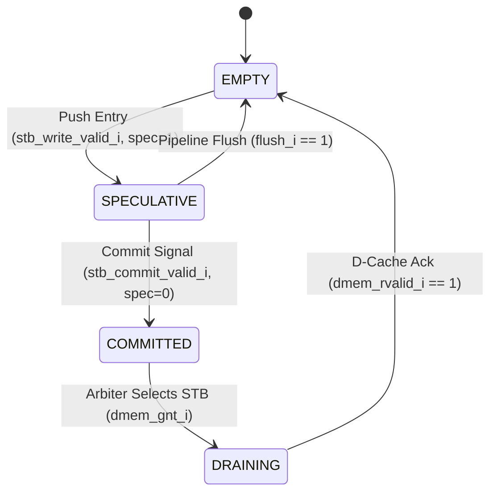

# Store Buffer (STB) Module

!!! abstract "Module Card"
    * :material-file-code: **RTL file:** `N/A`
    * :material-progress-wrench: **Status:** `Draft`

## 1. Parameters & Queue Layout

The STB is a circular FIFO queue of size `STB_DEPTH` holding speculative and committed store instructions.

| Parameter | Type | Default | Description |
| :--- | :---: | :---: | :--- |
| `STB_DEPTH` | `int` | `4` | Queue entries count (Must be power of 2, typically $\le 4$). |
| `TAG_WIDTH` | `int` | `4` | ROB instruction tag bit width. |

### Entry Fields

| Field | Width | Description |
| :--- | :---: | :--- |
| `valid` | 1 | Entry contains valid data |
| `speculative` | 1 | `1` = Speculative (uncommitted), `0` = Committed (ready to drain) |
| `addr` | 56 | Physical target address (`PA[55:0]`) |
| `wdata` | 64 | Store write payload |
| `be` | 8 | Byte enable mask |
| `size` | 2 | Access size (`00`=B, `01`=H, `10`=W, `11`=D) |
| `tag` | `TAG_WIDTH` | ROB tracking tag |

!!! note "Power Optimization (130nm ASIC)"
    To minimize dynamic switching power across inactive storage registers, entries with `valid == 0` must have clock gating applied via ICG (Integrated Clock Gating) cells.

## 2. Module Interface

| Signal | Type | Width | Direction | Description |
| :--- | :---: | :---: | :---: | :--- |
| **Stage 6 Write** | | | | |
| `stb_write_valid_i` | `logic` | 1 | IN | Push new store entry from LSU Execute |
| `stb_write_addr_i` | `logic` | 56 | IN | Target physical address (`PA[55:0]`) |
| `stb_write_wdata_i` | `logic` | 64 | IN | Write payload data |
| `stb_write_be_i` | `logic` | 8 | IN | Byte enable mask |
| `stb_write_size_i` | `logic` | 2 | IN | Access size |
| `stb_write_tag_i` | `logic` | `TAG_WIDTH` | IN | ROB instruction tag |
| `stb_full_o` | `logic` | 1 | OUT | STB full stall signal to Stage 5 Dispatch |
| **Stage 7 Commit** | | | | |
| `stb_commit_valid_i` | `logic` | 1 | IN | Commit signal from Writeback stage |
| `stb_commit_tag_i` | `logic` | `TAG_WIDTH` | IN | Tag of committing store instruction |
| `stb_empty_o` | `logic` | 1 | OUT | Active high when all entries (speculative and committed) are clear |
| **Stage 6 Bypass Query**| | | | |
| `load_addr_i` | `logic` | 56 | IN | Target physical address of concurrent load (`PA[55:0]`) |
| `load_size_i` | `logic` | 2 | IN | Access size of load |
| `load_bypass_hit_o` | `logic` | 1 | OUT | Asserted on full byte match with a STB entry |
| `load_bypass_data_o`| `logic` | 64 | OUT | Forwarded store payload data |
| `load_bypass_stall_o`| `logic` | 1 | OUT | Asserted on partial address overlap (requires load stall) |
| **D-Cache Drain Port** | | | | |
| `stb_dmem_req_o` | `logic` | 1 | OUT | Request to drain committed store to Cache |
| `stb_dmem_addr_o` | `logic` | 56 | OUT | Target physical address (`PA[55:0]`) |
| `stb_dmem_wdata_o` | `logic` | 64 | OUT | Write payload data |
| `stb_dmem_be_o` | `logic` | 8 | OUT | Byte enable strobes |
| `stb_dmem_size_o` | `logic` | 2 | OUT | Transaction size |
| `stb_dmem_gnt_i` | `logic` | 1 | IN | D-Cache address phase grant |
| `dmem_rvalid_i` | `logic` | 1 | IN | D-Cache write completion ack |

## 3. Entry Lifecycle & Pipeline Flush



* **Allocation (Stage 6):** Pushes store to `write_ptr` with `valid = 1` and `speculative = 1`.
* **Commit (Stage 7):** On ROB tag match, clears `speculative` flag (`speculative <= 0`).
* **Drain (Background):** Drains oldest committed entry (`speculative == 0`) to L1 Cache when memory bus is granted.
* **Pipeline Flush (`flush_i == 1`):** Instantly clears all entries with `speculative == 1` and rolls back `write_ptr`. Committed entries (`speculative == 0`) **are preserved** and allowed to drain.

## 4. Store-to-Load Forwarding (Load Bypassing)

Concurrent loads in Stage 6 query the STB in parallel with the L1 Data Cache:

```
    Load Address (Stage 6) ──► STB Comparator (All Entries)
                                        │
             ┌──────────────────────────┼──────────────────────────┐
             ▼                          ▼                          ▼
     Full Byte Match           Partial Byte Overlap            No Overlap
   (load_bypass_hit_o=1)     (load_bypass_stall_o=1)    (load_bypass_hit_o=0)
             │                          │                          │
             ▼                          ▼                          ▼
 Forward Youngest `wdata`     Stall Load in Stage 6      Read L1 D-Cache
```

1. **Youngest Entry Selection:** When multiple entries in the STB match the target load address, the entry with the highest modular index relative to `read_ptr` (i.e. the newest/youngest store closest to the FIFO tail) is selected for forwarding.
2. **Full Match:** Load address & size fall entirely within byte enable (`be`) of a STB entry $\rightarrow$ bypass data from the youngest matching entry (`load_bypass_hit_o = 1`).
3. **Partial Overlap:** Load overlaps a STB entry, but the entry does not cover all requested bytes $\rightarrow$ assert `load_bypass_stall_o = 1` to stall the load until conflicting stores drain to D-Cache.
4. **No Overlap:** No matching STB bytes $\rightarrow$ read normally from L1 D-Cache.

## 5. Verification

The Store Buffer module is verified using formal assertions and random testing:

### Formal SVA Assertion Table

| Assertion ID | Property / Condition | Severity | Checkpoint | Description |
| :--- | :--- | :---: | :---: | :--- |
| `SVA_STB_01` | `(load_partial_overlap) |-> (load_bypass_stall_o == 1'b1)` | `FATAL` | **CHK-LSU-05** | Partial address overlap between load and STB store MUST force a bypass stall |
| `SVA_STB_02` | `flush_i |=> (stb_speculative_count == '0)` | `ERROR` | **CHK-LSU-01** | Pipeline flush must clear all speculative entries without discarding committed |
| `SVA_STB_03` | `(stb_entry_committed && !rst_ni_flush) |=> (stb_entry_valid)` | `FATAL` | **CHK-LSU-04** | Committed STB entries must persist until acknowledged by D-Cache drain ack |
| `SVA_STB_04` | `(stb_full_o && stb_write_valid_i) |-> $error` | `FATAL` | **CHK-LSU-05** | Write into full STB without prior commit/drain is forbidden |
| `SVA_STB_05` | `(load_bypass_hit_o && (matching_count > 1)) |-> (forwarded_entry == youngest_entry)` | `ERROR` | **CHK-LSU-06** | Bypassed load data must strictly originate from the youngest matching store |

### Coverage Metrics
* 100% functional coverage of forwarding hit permutations (8-bit byte mask combinations).
* Verification of pointer wrap-around and rollback during branch mispredictions.
