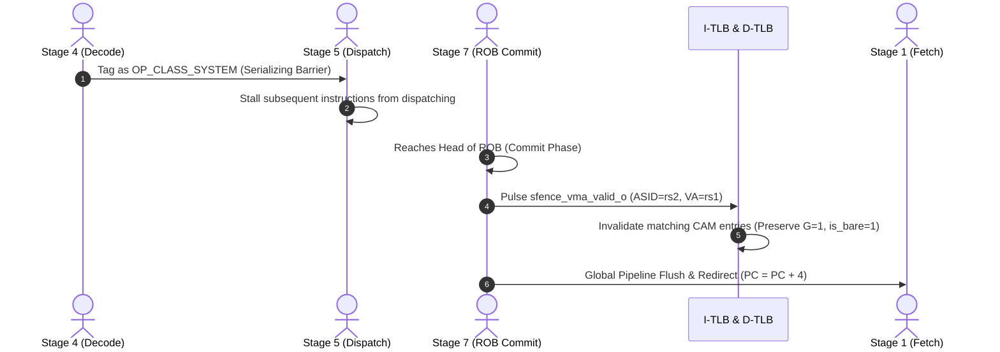
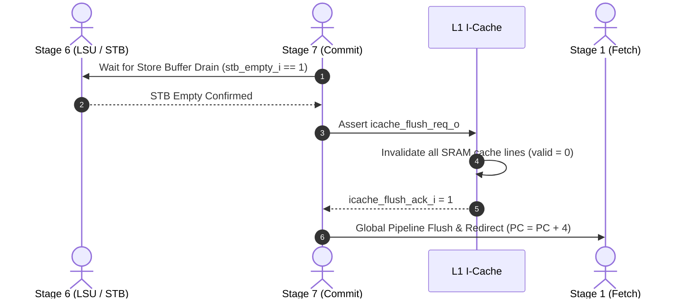

# Synchronization and Memory Fence Instructions

!!! abstract "Module Card"
    * :material-file-code: **RTL file:** `N/A`
    * :material-progress-wrench: **Status:** `Draft`

## 1. Overview

This document specifies the microarchitectural execution model, pipeline interaction, and hardware sequencing for RISC-V synchronization and barrier instructions in the Crab Core:

* **`SFENCE.VMA`:** Supervisor Fence Virtual Memory (Translation Lookaside Buffer Invalidation).
* **`FENCE`:** Memory and I/O Ordering Barrier (RVWMO Memory Model).
* **`FENCE.I`:** Instruction-Fetch Synchronization (Instruction Cache Coherence).

## 2. `SFENCE.VMA` (Supervisor Fence Virtual Memory)

### 2.1 Architectural Semantics
The `SFENCE.VMA rs1, rs2` instruction synchronizes updates to in-memory page tables with subsequent memory accesses. It invalidates cached address translations in the distributed I-TLB (Stage 1) and D-TLB (Stage 6).

* `rs1` specifies the Virtual Address (`VA`) filter (if `rs1 == x0`, all virtual addresses are targeted).
* `rs2` specifies the Address Space Identifier (`ASID`) filter (if `rs2 == x0`, all ASIDs are targeted).

### 2.2 Pipeline Execution Flow

1. **Decode & Dispatch Phase:** `SFENCE.VMA` is decoded with `op_class = OP_CLASS_SYSTEM`. Dispatch treats it as a serializing instruction and halts dispatching younger instructions into the execution pipelines until `SFENCE.VMA` retires.
2. **Commit Phase (Stage 7):** When `SFENCE.VMA` reaches the head of the ROB:
    * The CSR/Commit block asserts `sfence_vma_valid_o = 1` alongside `sfence_vma_asid_o [15:0]` and `sfence_vma_addr_o [63:0]`.
    * Both I-TLB and D-TLB evaluate their CAM entries in parallel within 1 clock cycle:
        * **ASID Filter:** If `sfence_vma_asid_o != 16'd0`, only entries with `entry.asid == sfence_vma_asid_o` are targeted.
        * **VA Filter:** If `sfence_vma_addr_o != 64'd0`, only entries matching `(sfence_vma_addr_o[38:2] & mask) == (va_tag & mask)` are targeted.
        * **Preservation Rules:** Entries with Global flag `G == 1` or BARE mode flag `is_bare == 1` are **strictly preserved** across `SFENCE.VMA`.
3. **Pipeline Redirect:** The Commit stage asserts `flush_req_o = 1` and redirects Fetch to `PC + 4`, guaranteeing that subsequent instructions execute under the updated translation state.

## 3. `FENCE` (Memory and I/O Ordering Barrier)

### 3.1 Architectural Semantics
The `FENCE pred, succ` instruction orders device I/O and memory accesses as viewed by other RISC-V harts and external bus masters. The predecessor (`pred`) and successor (`succ`) sets consist of any combination of Read (`R`), Write (`W`), Input (`I`), and Output (`O`).

### 3.2 Microarchitectural Implementation

In the single-hart in-order core with an out-of-order retirement buffer:

* **Predecessor Drain (`pred.W` or `pred.O`):** If `pred` includes writes or outputs, the LSU FSM stalls new memory requests until the Store Buffer is completely empty (`stb_empty_i == 1`) and all in-flight D-Cache write-back transactions have received bus acknowledgments (`dmem_rvalid_i == 1`).
* **Predecessor Reads (`pred.R` or `pred.I`):** If `pred` includes reads or inputs, all prior load instructions must have completed and written their results to the ROB.
* **Successor Release:** Once all predecessor dependencies are resolved, the barrier clears and successor memory operations are permitted to execute.

## 4. `FENCE.I` (Instruction-Fetch Synchronization)

### 4.1 Architectural Semantics
The `FENCE.I` instruction ensures that stores to instruction memory (e.g. self-modifying code, dynamic JIT compilation, or OS program loading) are made visible to subsequent instruction fetches on the executing hart.

### 4.2 Pipeline Execution Flow

1. **STB Drain:** `FENCE.I` at Commit forces all pending store operations in the Store Buffer (STB) to drain to the L1 D-Cache and main memory (DRAM/HyperRAM).
2. **L1 I-Cache Invalidation:** The Commit stage pulses `icache_flush_req_o` to the L1 Instruction Cache controller. The I-Cache controller invalidates all cache lines by clearing the valid bits in its tag array.
3. **Pipeline Flush & Refetch:** A global pipeline flush is asserted, discarding any pre-fetched instructions in Stage 1–5 buffers and restarting fetch from the sequential `PC + 4`.
