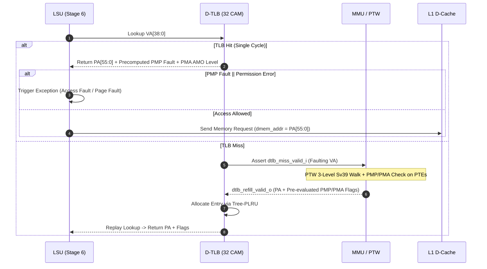
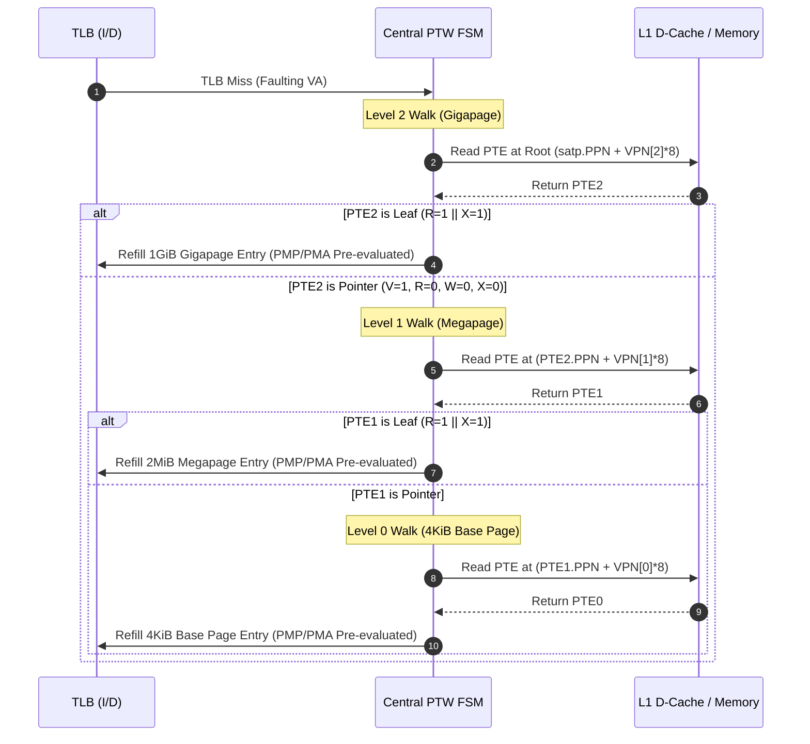

# Memory Management Unit Overview

!!! abstract "Module Card"
    * :material-file-code: **RTL file:** `N/A`
    * :material-progress-wrench: **Status:** `Draft`

## 1. Summary

The **Memory Management Unit (MMU)** is the central memory protection and address translation control subsystem in the Crab Core. It coordinates virtual-to-physical address translation for Supervisor (`S`) and User (`U`) modes under the RISC-V **Sv39** scheme, enforces Physical Memory Protection (**PMP**) and Physical Memory Attribute (**PMA**) security policies, and manages the shared **Hardware Page Table Walker (PTW)** for refilling distributed I-TLB and D-TLB instances. The MMU operates in the memory subsystem region, interfacing directly with the L1 D-Cache controller for PTE memory fetches and with distributed TLBs for translation refills. The MMU does not directly interface with the core execution pipelines, maintaining strict modular isolation.

## 2. Architectural Requirements

The MMU implements the RISC-V Privileged Architecture Specification (v1.12) with the following features:

* **Sv39 Page-Based Virtual Memory:**
    * 39-bit Virtual Address (`VA[38:0]`) translated to 56-bit Physical Address (`PA[55:0]`).
    * 3-level page table hierarchy (Gigapages 1 GiB, Megapages 2 MiB, Base pages 4 KiB).
* **`Svpbmts` Extension Support:**
    * Page-Based Memory Types using bits `PTE[62:61]` (`PBMT`): `00` (PMA Default), `01` (Non-Cacheable Main Memory), `10` (Uncached Non-Idempotent I/O).
* **Privilege & Bypass Control:**
    * **M-mode (Machine Mode) Bare Addressing:** Bypasses translation (`PA == VA`) and page table walking when executing in Machine mode (`curr_priv == PRIV_MACHINE`), subject to locked PMP rules (`L=1`).
    * **`satp.MODE == Bare` (0):** Disables virtual translation for all privilege modes.
    * **`mstatus.MPRV` Override:** Allows M-mode memory data accesses to evaluate translation and protection using privilege level `mstatus.MPP` (does not affect instruction fetch).
* **TLB Invalidation (`SFENCE.VMA`):**
    * Broadcasts flush signals to distributed I-TLB and D-TLB modules by Address (`VA`) or Address Space Identifier (`ASID`).
* **PMA AMO Capability Levels:**
    * Classifies physical regions into 4 atomic levels: `PMA_AMO_NONE`, `PMA_AMO_SWAP`, `PMA_AMO_LOGICAL`, `PMA_AMO_ARITHMETIC`.
* **Page Fault Exception Generation:**
    * *Instruction Page Fault:* `cause = 12` (Stage 1 Fetch).
    * *Load Page Fault:* `cause = 13` (Stage 6 Load).
    * *Store/AMO Page Fault:* `cause = 15` (Stage 6 Store/AMO).

## 3. Memory System Architecture

```
        |   ^                                                                  |   ^
        V   |                                                                  V   |
+-------------------+       +----------------------------------+       +-------------------+
| I-Cache Subsystem |       |         MMU CORE (Central)       |       | D-Cache Subsystem |
|                   |       |                                  |       |                   |
|  - I-TLB (16 CAM) |<----->|  - Shared Hardware PTW FSM       |<----->|  - D-TLB (32 CAM) |
|  - I-Cache SRAM   |       |  - satp / mstatus Decode         |       |  - D-Cache SRAM   |
|                   |       |  - Shadow PMP Registers (16)     |       |  - AMO ALU (RMW)  |
|                   |       |  - PMA Decoder + Svpbmts         |       |                   |
+-------------------+       +----------------------------------+       +-------------------+
          ^                      ^                                               ^
          |                      |                                               |
          V                     csr                                              V
+-------------------+                                                  +-------------------+
|   Stage 1 Fetch   |                                                  |    Stage 6 LSU    |
+-------------------+                                                  +-------------------+
```

## 4. Interfaces

### 4.1 Clock, Reset and CSR Control Interface

| Signal | Type | Width | Direction | Description |
| :--- | :---: | :---: | :---: | :--- |
| `clk_i` | `logic` | 1 | IN | Main core clock signal |
| `rst_ni` | `logic` | 1 | IN | Asynchronous active-low reset signal |
| `flush_i` | `logic` | 1 | IN | Global pipeline flush (aborts active PTW walk in 1 cycle) |
| `curr_priv_i` | `priv_mode_t` | 2 | IN | Current processor privilege level (`M`, `S`, `U`) |
| `satp_i` | `satp_reg_t` | 64 | IN | Supervisor Address Translation and Protection register (`MODE`, `ASID`, `PPN`) |
| `mstatus_i` | `mstatus_reg_t` | 64 | IN | Machine Status register (`MPRV`, `MPP`, `SUM`, `MXR`) |
| `pmp_write_valid_i` | `logic` | 1 | IN | 70-bit broadcast bus: valid write pulse on PMP CSR commit |
| `pmp_write_idx_i` | `logic` | 5 | IN | 70-bit broadcast bus: target register index (`0..3` cfg, `0..15` addr) |
| `pmp_write_data_i` | `logic` | 64 | IN | 70-bit broadcast bus: write payload data |

### 4.2 I-TLB Subsystem Interface

| Signal | Type | Width | Direction | Description |
| :--- | :---: | :---: | :---: | :--- |
| `itlb_lookup_priv_mode_i`| `priv_mode_t` | 2 | IN | Current processor privilege level for fetch permission validation |
| `itlb_miss_valid_i` | `logic` | 1 | IN | Asserted when I-TLB misses during instruction fetch |
| `itlb_miss_va_i` | `logic` | 64 | IN | Faulting virtual address for instruction fetch |
| `itlb_refill_valid_o` | `logic` | 1 | OUT | 1-cycle strobe indicating valid translation refill payload |
| `itlb_refill_vpn_o` | `logic` | 27 | OUT | Virtual page number tag (`VA[38:12]`) |
| `itlb_refill_page_size_o`| `page_size_t` | 2 | OUT | Refilled page size (`PAGE_4K`, `PAGE_2M`, `PAGE_1G`) |
| `itlb_refill_ppn_o` | `logic` | 44 | OUT | Physical page number translation payload (`PA[55:12]`) |
| `itlb_refill_flags_o` | `pte_flags_t` | 8 | OUT | Page permission flags (`R`, `W`, `X`, `U`, `G`, `A`, `D`, `PBMT`) |
| `itlb_refill_pmp_fault_o`| `logic` | 1 | OUT | Pre-evaluated PMP permission fault flag cached in TLB entry |
| `itlb_refill_pma_cacheable_o`| `logic` | 1 | OUT | Pre-evaluated PMA cacheability attribute |
| `itlb_page_fault_o` | `logic` | 1 | OUT | Strobe asserting instruction page fault exception |
| `itlb_page_fault_cause_o` | `logic` | 6 | OUT | Exception cause code (`cause = 12`) |

### 4.3 D-TLB Subsystem Interface (and LSU `tlbpm_*` Mapping)

#### D-TLB Runtime Lookup & PTW Refill Ports:

| Signal | Type | Width | Direction | Description |
| :--- | :---: | :---: | :---: | :--- |
| `dtlb_lookup_valid_i` | `logic` | 1 | IN | Lookup request valid strobe from Stage 6 LSU |
| `dtlb_lookup_va_i` | `logic` | 64 | IN | Target virtual address (`VA[63:0]`) to translate |
| `dtlb_req_r_i` | `logic` | 1 | IN | Access requires Read permission (Load / AMO) |
| `dtlb_req_w_i` | `logic` | 1 | IN | Access requires Write permission (Store / AMO) |
| `dtlb_lookup_ready_o` | `logic` | 1 | OUT | Response valid (`1` = TLB Hit / Ready, `0` = TLB Miss / Stalled) |
| `dtlb_lookup_pa_o` | `logic` | 56 | OUT | Translated 56-bit Physical Address (`PA[55:0]`) |
| `dtlb_err_r_o` | `logic` | 1 | OUT | Denied read permission (`cause = 5` Access Fault or `13` Page Fault) |
| `dtlb_err_w_o` | `logic` | 1 | OUT | Denied write permission (`cause = 7` Access Fault or `15` Page Fault) |
| `dtlb_pma_cacheable_o` | `logic` | 1 | OUT | Pre-evaluated cacheability flag (`1` = DRAM, `0` = MMIO) |
| `dtlb_pma_amo_level_o` | `pma_amo_level_t` | 2 | OUT | Pre-evaluated atomic capability level (`None`, `Swap`, `Logical`, `Arith`) |
| `dtlb_miss_valid_i` | `logic` | 1 | IN | Internal miss signal routed to Hardware PTW |
| `dtlb_miss_va_i` | `logic` | 64 | IN | Faulting virtual address for PTW page table walk |
| `dtlb_miss_op_i` | `logic` | 2 | IN | Access intent: `00` = Read (Load), `01` = Write (Store), `10` = Atomic (AMO) |
| `dtlb_refill_valid_o` | `logic` | 1 | OUT | 1-cycle strobe indicating valid translation refill payload from PTW |
| `dtlb_refill_vpn_o` | `logic` | 27 | OUT | Virtual page number tag (`VA[38:12]`) |
| `dtlb_refill_page_size_o`| `page_size_t` | 2 | OUT | Refilled page size (`PAGE_4K`, `PAGE_2M`, `PAGE_1G`) |
| `dtlb_refill_ppn_o` | `logic` | 44 | OUT | Physical page number translation payload (`PA[55:12]`) |
| `dtlb_refill_flags_o` | `pte_flags_t` | 8 | OUT | Page permission flags (`R`, `W`, `X`, `U`, `G`, `A`, `D`, `PBMT`) |
| `dtlb_refill_pmp_fault_o`| `logic` | 1 | OUT | Pre-evaluated PMP permission fault flag cached in TLB entry |
| `dtlb_refill_pma_cacheable_o`| `logic` | 1 | OUT | Pre-evaluated PMA cacheability attribute |
| `dtlb_refill_pma_amo_level_o`| `pma_amo_level_t` | 2 | OUT | Pre-evaluated PMA atomic capability level |
| `dtlb_page_fault_o` | `logic` | 1 | OUT | Strobe asserting load/store/AMO page fault exception |
| `dtlb_page_fault_cause_o` | `logic` | 6 | OUT | Exception cause code (`cause = 13` Load, `cause = 15` Store/AMO) |

#### Cross-Module Port Mapping: LSU (`docs/uarch/execute/lsu/overview.md` §5.4) $\leftrightarrow$ D-TLB:

| LSU Port Name | D-TLB Port Name | Direction (re. LSU) | Width | Description |
| :--- | :--- | :---: | :---: | :--- |
| `tlbpm_valid_o` | `dtlb_lookup_valid_i` | OUT | 1 | Translation lookup strobe |
| `tlbpm_addr_o` | `dtlb_lookup_va_i` | OUT | 64 | Virtual Address ($VA[63:0]$) |
| `tlbpm_req_r_o` | `dtlb_req_r_i` | OUT | 1 | Read intent flag |
| `tlbpm_req_w_o` | `dtlb_req_w_i` | OUT | 1 | Write intent flag |
| `tlbpm_rvalid_i` | `dtlb_lookup_ready_o` | IN | 1 | TLB Hit / Ready acknowledgment |
| `tlbpm_addr_i` | `dtlb_lookup_pa_o` | IN | 56 | Physical Address ($PA[55:0]$) |
| `tlbpm_err_r_i` | `dtlb_err_r_o` | IN | 1 | Read permission fault |
| `tlbpm_err_w_i` | `dtlb_err_w_o` | IN | 1 | Write permission fault |
| `tlbpm_cacheable_i` | `dtlb_pma_cacheable_o` | IN | 1 | Cacheable DRAM indicator |
| `tlbpm_pma_amo_level_i`| `dtlb_pma_amo_level_o` | IN | 2 | Supported AMO capability level |


### 4.4 PTW Memory Access Interface (to L1 D-Cache)

| Signal | Type | Width | Direction | Description |
| :--- | :---: | :---: | :---: | :--- |
| `ptw_req_o` | `logic` | 1 | OUT | Memory read request for PTE fetch issued to L1 D-Cache |
| `ptw_gnt_i` | `logic` | 1 | IN | Grant from L1 D-Cache port arbiter accepting address phase |
| `ptw_addr_o` | `logic` | 56 | OUT | Physical address of Page Table Entry (`PA[55:0]`) |
| `ptw_rvalid_i` | `logic` | 1 | IN | Data validation strobe indicating PTE data available |
| `ptw_rdata_i` | `logic` | 64 | IN | 64-bit raw Page Table Entry content from memory |
| `ptw_err_i` | `logic` | 1 | IN | Bus error or PMP violation response on PTE fetch |

### 4.5 Invalidation and Synchronization Interface

| Signal | Type | Width | Direction | Description |
| :--- | :---: | :---: | :---: | :--- |
| `sfence_vma_valid_i` | `logic` | 1 | IN | Broadcast strobe from Commit executing `SFENCE.VMA` |
| `sfence_vma_asid_i` | `logic` | 16 | IN | Target ASID filter for TLB invalidation (`0` = all ASIDs) |
| `sfence_vma_addr_i` | `logic` | 64 | IN | Target virtual address filter for TLB invalidation (`0` = all VAs) |
| `itlb_flush_o` | `logic` | 1 | OUT | Invalidation pulse routed to I-TLB array |
| `dtlb_flush_o` | `logic` | 1 | OUT | Invalidation pulse routed to D-TLB array |

## 5. Functional Description

### 5.1 Memory Access & Pre-Evaluated Protection Flow



!!! note "Elimination of PMP from Critical Path"
    Because Physical Memory Protection (PMP) rules are pre-evaluated at Page Table Walk refill time and cached inside the TLB entry (`pmp_fault` flag), runtime TLB lookups do not invoke the 16-entry PMP comparator bank. This design meets the 10 ns clock budget on the 130nm ASIC technology.

### 5.2 Translation Mode & Enable Logic

Address translation and TLB lookup enablement is governed by CPU privilege and `satp` configuration:

```systemverilog
// Effective Privilege Level (accounting for mstatus.MPRV for data accesses)
assign eff_priv_d = (mstatus_i.mprv && (curr_priv_i == PRIV_MACHINE)) ? mstatus_i.mpp : curr_priv_i;

// Translation Enable Flags
assign itlb_trans_en_o = (curr_priv_i != PRIV_MACHINE) && (satp_i.mode == 4'd8);
assign dtlb_trans_en_o = (eff_priv_d != PRIV_MACHINE) && (satp_i.mode == 4'd8);
```

!!! note "Translation Bypass (BARE Mode)"
    When `itlb_trans_en_o == 0` or `dtlb_trans_en_o == 0`, address translation is bypassed (`PA == VA`). To maintain single-cycle PMP checks without multi-stage comparator logic, BARE mode accesses are cached in the TLB with `is_bare = 1`.

### 5.3 Page Table Walk Sequence (Sv39 3-Level Walk)

When an I-TLB or D-TLB miss occurs, the central Hardware PTW FSM initiates a page table walk:



### 5.4 Page Fault Exception Handling

The MMU triggers a Page Fault exception to the committing stage when any of the following conditions occur during a page table walk:

1. **Invalid Entry (`V == 0`):** Any level PTE has valid bit cleared.
2. **Write Without Read (`W == 1 && R == 0`):** Reserved bit combination in RISC-V specification.
3. **Misaligned Superpage:** A leaf PTE at Level 2 has `PPN[1:0] != 0` or at Level 1 has `PPN[0] != 0`.
4. **Privilege Fault:**
    * User mode (`U`) accessing a Supervisor page (`U == 0`).
    * Supervisor mode (`S`) accessing a User page (`U == 1`) when `mstatus.SUM == 0`.
5. **Access Permission Fault:**
    * Fetching an instruction from a non-executable page (`X == 0`).
    * Loading data from a non-readable page (`R == 0` and `mstatus.MXR == 0`).
    * Storing data to a non-writable page (`W == 0`).
6. **Accessed / Dirty Bit Fault:**
    * Reading a page with `A == 0` (hardware A/D update not enabled).
    * Writing a page with `D == 0` (hardware A/D update not enabled).

### 5.5 Atomic Memory Operation (AMO) Verification Rules in MMU

Because Atomic Memory Operations perform a Read-Modify-Write (RMW) cycle, the MMU enforces strict combined permission and PMA capability rules:

1. **PTE Page Permissions:** The leaf Page Table Entry **must have BOTH Read (`R == 1`) AND Write (`W == 1`) permissions**. If either bit is `0`, the MMU raises a **Store/AMO Page Fault (`cause = 15`)**.
2. **PTE A/D Bits:** The leaf PTE **must have BOTH Accessed (`A == 1`) AND Dirty (`D == 1`) bits set**. If `A == 0` or `D == 0`, the MMU raises a **Store/AMO Page Fault (`cause = 15`)**.
3. **PMP Permission Bounds:** PMP evaluation for AMOs **requires BOTH Read (`R`) AND Write (`W`) PMP permissions**. If either permission is missing, the MMU raises a **Store/AMO Access Fault (`cause = 7`)**.
4. **PMA Capability Verification:** The physical address target must satisfy the required `pma_amo_level_t`:
    * `LR/SC` and arithmetic AMOs (`AMOADD`, `AMOMIN`, etc.) require `PMA_AMO_ARITHMETIC`.
    * Logical AMOs (`AMOAND`, `AMOOR`, `AMOXOR`) require `PMA_AMO_LOGICAL` or higher.
    * `AMOSWAP` requires `PMA_AMO_SWAP` or higher.
    * If the region has `PMA_AMO_NONE` (or insufficient capability), the core raises a **Store/AMO Access Fault (`cause = 7`)**.
