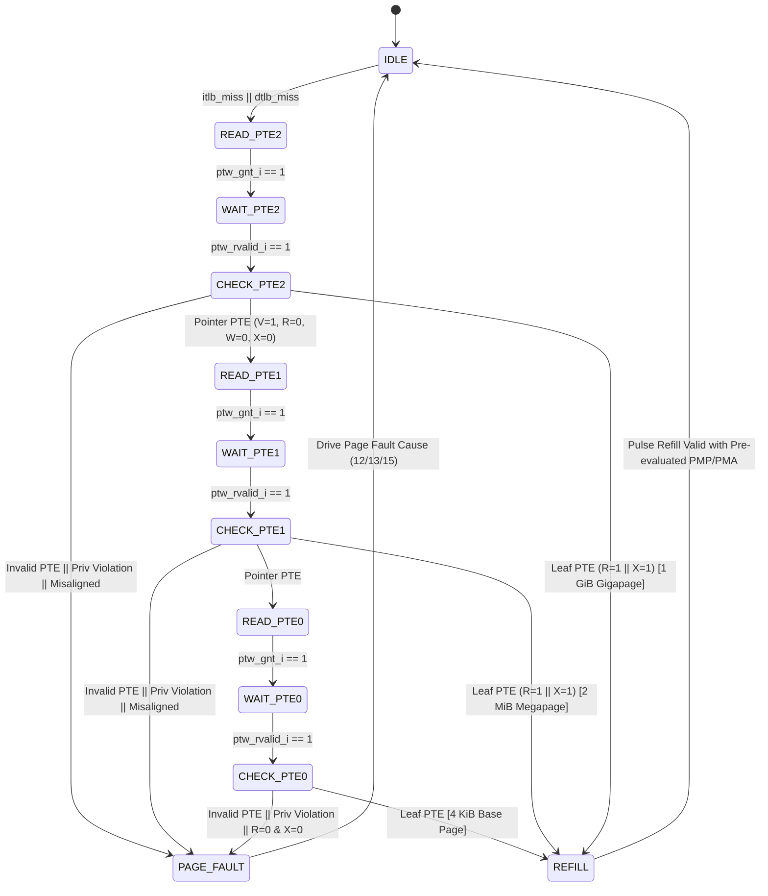

# Hardware Page Table Walker (PTW) Module

!!! abstract "Module Card"
    * :material-file-code: **RTL file:** `N/A`
    * :material-progress-wrench: **Status:** `Draft`

## 1. Overview

The **Hardware Page Table Walker (PTW)** is the central hardware state machine inside the MMU. When a Virtual Address lookup misses in either the distributed I-TLB or D-TLB, the PTW autonomously traverses the 3-level **Sv39** page table structure stored in physical DRAM, validates access permissions against PMP and PMA rules, and refills the requesting TLB with a fresh Physical Address mapping.

## 2. Page Table Walker FSM Diagram

## 3. Detailed FSM State Operations

### 3.1 State `IDLE` (Miss Arbitration & Starvation Protection)
* **Operation:** Monitors refill requests from I-TLB (`itlb_miss_valid_i`) and D-TLB (`dtlb_miss_valid_i`).
* **Arbitration & Starvation Prevention:**
  * By default, **D-TLB** is granted priority over I-TLB to unblock execution data hazards first.
  * **Starvation Counter:** An internal 3-bit counter tracks consecutive D-TLB walk grants. If D-TLB is granted $N=4$ consecutive walks while `itlb_miss_valid_i` remains asserted, priority forcibly switches to I-TLB for 1 walk cycle to prevent fetch starvation.
* **Transition:** Latches faulting Virtual Address (`VA`), instruction/data access intent, privilege mode, and initial root page table physical address `PTE_Addr = (satp.PPN << 12) + (VA.VPN[2] * 8)`. Transitions to `READ_PTE2`.

### 3.2 Level 2 Walk (`READ_PTE2` / `CHECK_PTE2`) - 1 GiB Gigapages
* **`READ_PTE2`:** Asserts `ptw_req_o = 1` and drives `ptw_addr_o = PTE_Addr`. On `ptw_gnt_i`, transitions to `WAIT_PTE2`.
* **`WAIT_PTE2`:** Awaits memory response `ptw_rvalid_i`.
* **`CHECK_PTE2`:** Inspects returned 64-bit `PTE2`:
  * If `PTE2.V == 0` or (`PTE2.W == 1 && PTE2.R == 0`) $\rightarrow$ transition to `PAGE_FAULT`.
  * If `PTE2.R == 1` or `PTE2.X == 1` (Leaf Page):
    * Misaligned check: If `PTE2.PPN[1:0] != 0` $\rightarrow$ transition to `PAGE_FAULT`.
    * AMO Specific Rule: If access intent is an Atomic Operation (`dtlb_miss_op_i == 2'b10`), `PTE2` **must have BOTH `R==1` AND `W==1`**, as well as **BOTH `A==1` AND `D==1`**. If any is missing $\rightarrow$ transition to `PAGE_FAULT` (`cause = 15`).
    * Permission check: Evaluate `U`, `SUM`, `MXR`, `A`, `D` bits. If valid $\rightarrow$ transition to `REFILL` (1 GiB Gigapage).
  * If `PTE2.V == 1 && PTE2.R == 0 && PTE2.W == 0 && PTE2.X == 0` (Pointer):
    * Compute `Next_PTE_Addr = (PTE2.PPN << 12) + (VA.VPN[1] * 8)` and transition to `READ_PTE1`.

### 3.3 Level 1 Walk (`READ_PTE1` / `CHECK_PTE1`) - 2 MiB Megapages
* Same memory handshake sequence as Level 2.
* Inspects `PTE1`:
  * If Leaf (`R=1` or `X=1`):
    * Misaligned check: If `PTE1.PPN[0] != 0` $\rightarrow$ transition to `PAGE_FAULT`.
    * AMO Specific Rule: If access intent is an Atomic Operation (`dtlb_miss_op_i == 2'b10`), `PTE1` **must have BOTH `R==1` AND `W==1`**, as well as **BOTH `A==1` AND `D==1`**. If any is missing $\rightarrow$ transition to `PAGE_FAULT` (`cause = 15`).
    * Permission check: Evaluate permissions. If valid $\rightarrow$ transition to `REFILL` (2 MiB Megapage).
  * If Pointer $\rightarrow$ Compute `Next_PTE_Addr = (PTE1.PPN << 12) + (VA.VPN[0] * 8)` and transition to `READ_PTE0`.

### 3.4 Level 0 Walk (`READ_PTE0` / `CHECK_PTE0`) - 4 KiB Base Pages
* Same memory handshake sequence as Level 1.
* Inspects `PTE0`:
  * `PTE0` must be a Leaf page (`R=1` or `X=1`). If `R=0 && X=0` $\rightarrow$ transition to `PAGE_FAULT`.
  * AMO Specific Rule: If access intent is an Atomic Operation (`dtlb_miss_op_i == 2'b10`), `PTE0` **must have BOTH `R==1` AND `W==1`**, as well as **BOTH `A==1` AND `D==1`**. If any is missing $\rightarrow$ transition to `PAGE_FAULT` (`cause = 15`).
  * Evaluate permissions. If valid $\rightarrow$ transition to `REFILL` (4 KiB Base Page).

### 3.5 State `REFILL` (PA Composition, Variable-Mask & PMP/PMA Pre-Evaluation)

During the `REFILL` state, the PTW finalizes the translation entry before issuing the 1-cycle refill strobe:

1. **Physical Address ($PA[55:0]$) Composition:**
   Based on the resolved page table leaf level, the full 56-bit Physical Address (`PA[55:0]`) is composed from the PTE's PPN field (`PTE[53:10]`) and the faulting Virtual Address (`VA[38:0]`):
   * **Level 2 (1 GiB Gigapage Leaf):**
     $$
     PA[55:30] = PTE[53:28] \quad (PPN[2]), \qquad PA[29:0] = VA[29:0]
     $$
     *(Requires $PTE.PPN[1:0] == 0$; misaligned superpages trigger Page Fault in `CHECK_PTE2`).*
   * **Level 1 (2 MiB Megapage Leaf):**
     $$
     PA[55:21] = PTE[53:19] \quad (PPN[2:1]), \qquad PA[20:0] = VA[20:0]
     $$
     *(Requires $PTE.PPN[0] == 0$; misaligned superpages trigger Page Fault in `CHECK_PTE1`).*
   * **Level 0 (4 KiB Base Page Leaf):**
     $$
     PA[55:12] = PTE[53:10] \quad (PPN[2:0]), \qquad PA[11:0] = VA[11:0]
     $$

2. **Variable-Mask CAM Computation ($M_{\text{eff}}[36:0]$):**
   The effective 37-bit comparison mask covering $\min(\text{Page Size}, \text{PMP/PMA Region})$ (corresponding to $VA[38:2]$) is evaluated as:
   $$
   M_{\text{eff}} = M_{\text{page}} \ | \ M_{\text{pmp}}
   $$
   where:
   * **Page Size Base Mask ($M_{\text{page}}$):**
     * 1 GiB Gigapage: $M_{\text{page}} = \{9\text{'b}111\_111\_111, \, 28\text{'b}0\}$ (evaluates $VA[38:30]$)
     * 2 MiB Megapage: $M_{\text{page}} = \{18\text{'b}111...111, \, 19\text{'b}0\}$ (evaluates $VA[38:21]$)
     * 4 KiB Base Page: $M_{\text{page}} = \{27\text{'b}111...111, \, 10\text{'b}0\}$ (evaluates $VA[38:12]$)
   * **PMP Matching Granularity Mask ($M_{\text{pmp}}$):**
     * OFF / TOR (region $\ge$ page): $M_{\text{pmp}} = M_{\text{page}}$
     * NA4 (4 bytes): $M_{\text{pmp}} = 37\text{'b}111...111$ (evaluates $VA[38:2]$)
     * NAPOT ($2^K$ bytes, $K \ge 3$): $M_{\text{pmp}}$ contains $39 - K$ leading ones.

3. **1-Cycle Combinational PMP & PMA Pre-Evaluation:**
   * The composed $PA[55:0]$ is evaluated against the 16 Shadow PMP registers in parallel ($\sim 4.5\text{ ns}$ delay), setting `pmp_fault = 1` on permission violation.
   * Concurrently, $PA[55:0]$ and `PTE[62:61]` (PBMT) are decoded by the PMA module to determine `pma_cacheable` and `pma_amo_level`.
   * Total REFILL path delay is $9.3\text{ ns}$, meeting the $10.0\text{ ns}$ clock budget in a single cycle.

4. **Refill Handshake:**
   * Asserts `itlb_refill_valid_o = 1` or `dtlb_refill_valid_o = 1` for 1 clock cycle driving `vpn_tag`, `pa_tag` ($PA[55:2]$), `mask` ($M_{\text{eff}}$), `pte_flags`, and pre-evaluated attributes.
   * Returns to `IDLE`.

### 3.6 State `PAGE_FAULT`
* Asserts `itlb_page_fault_o` or `dtlb_page_fault_o`.
* Drives exact cause code:
  * `cause = 12`: Instruction Page Fault (Fetch).
  * `cause = 13`: Load Page Fault (Load).
  * `cause = 15`: Store/AMO Page Fault (Store/AMO).
* Returns to `IDLE`.

### 3.7 PTE Accessed (A) and Dirty (D) Bit Management

* **Baseline Implementation (v1.0 - Software-Managed A/D):**
  * When evaluating a leaf PTE, if `A == 0` (for any access) or `D == 0` (for Store/AMO access), the PTW transitions directly to `PAGE_FAULT`.
  * The operating system trap handler updates `PTE.A` and `PTE.D` in memory and retries the instruction.
  * This keeps the PTW FSM simple and read-only, avoiding memory write ports and coherence races with the L1 D-Cache.

!!! note "Future Architectural Upgrade: Hardware-Managed A/D (v2.0)"
    In the next iteration of the core (v2.0 / superscalar), the PTW can be upgraded to **Hardware-Managed A/D**:
    * Adding a dedicated `WRITE_PTE_AD` state in the PTW FSM to perform an atomic read-modify-write cycle on the PTE in DRAM/Cache.
    * Adding a write channel (`ptw_we_o`, `ptw_wdata_o`) to the L1 D-Cache port arbiter.
    * This will reduce first-touch page access overhead from hundreds of software trap cycles to just 2–3 hardware cycles.

## 4. Pipeline Flush and Abort Behavior (`flush_i`)

When `flush_i` is asserted (due to branch misprediction, trap, or PMP/satp write):
* The PTW FSM immediately aborts any active walk and returns to `IDLE` in 1 cycle.
* Any pending memory response (`ptw_rvalid_i`) arriving in subsequent cycles is discarded.
* No refill strobe (`*_refill_valid_o`) is generated, preventing stale translation entries from polluting the TLB.

## 5. Performance & Memory Bus Latency

* **L1 D-Cache PTE Integration:** All memory read requests (`ptw_req_o`) issued by the PTW are routed directly through the **L1 D-Cache**. Because upper page table nodes (Level 2 Gigapage and Level 1 Megapage tables) are frequently accessed across process execution, they remain resident in the L1 D-Cache.
* **PMP Check on PTE Reads:** Memory requests issued by PTW for reading page table entries are subject to PMP validation. If a PTE fetch violates PMP, the D-Cache returns `ptw_err_i = 1`, which triggers an Access Fault.
* **Best Case (TLB Hit):** 0 PTW cycles (single-cycle VIPT lookup in L1 Cache).
* **L1 D-Cache Hit Walk Latency (3 Levels):** 3 memory access round-trips (~3 to 6 cycles total when PTEs hit in L1 D-Cache).
* **L1 D-Cache Miss Walk Latency:** ~15 to 30 cycles if PTE reads miss L1 D-Cache and require external RAM fetch over Wishbone/AXI interconnect.
* **Superpage Walk Latency:** 1 memory lookup cycle for Gigapages (1 GiB), 2 memory lookup cycles for Megapages (2 MiB).
